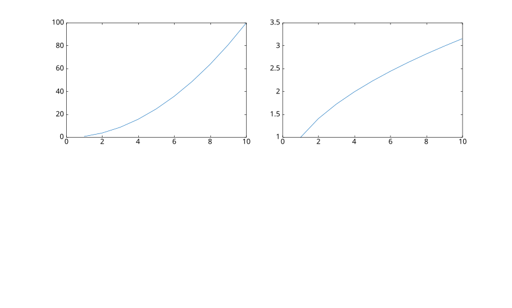

# tiledlayout

Créer une disposition en mosaïque.

## 📝 Syntaxe

- t = tiledlayout
- t = tiledlayout(m, n)
- t = tiledlayout(arrangement)
- t = tiledlayout(parent, ...)
- t = tiledlayout(..., propertyName, propertyValue)

## 📥 Argument d'entrée

- m - Nombre de lignes de tuiles : entier positif.
- n - Nombre de colonnes de tuiles : entier positif.
- arrangement - 'flow', 'vertical' ou 'horizontal' : mode de disposition automatique.
- parent - Poignée de la figure parente.
- propertyName - Nom de la propriété : 'TileSpacing', 'Padding', 'TileIndexing' ou autre propriété de disposition.
- propertyValue - Valeur de la propriété correspondant au nom de la propriété.

## 📤 Argument de sortie

- t - Objet graphique TiledChartLayout.

## 📄 Description

<b>tiledlayout</b> crée une disposition en mosaïque dans la figure courante pour afficher plusieurs tracés dans une grille.

<b>tiledlayout</b> sans argument d'entrée crée une disposition de type flux.

<b>tiledlayout(m, n)</b> crée une disposition avec m lignes et n colonnes de tuiles.

<b>tiledlayout('flow')</b> crée une disposition qui ajuste automatiquement la grille au fur et à mesure que des axes sont ajoutés. <b>tiledlayout('vertical')</b> empile les axes de haut en bas, et <b>tiledlayout('horizontal')</b> les empile de gauche à droite.

Utilisez <b>nexttile</b> pour créer des axes dans la disposition.

Voir [proprietes de tiledlayout](../../../graphics/2_graphics_objects/4_properties/nelson.graphics.tiledlayout.properties.md) pour la liste complete des proprietes.

## 💡 Exemple

Disposition en mosaïque 2 par 2

```matlab
t = tiledlayout(2, 2);
ax1 = nexttile;
plot(ax1, 1:10, (1:10).^2);
ax2 = nexttile;
plot(ax2, 1:10, sqrt(1:10));
t.TileSpacing = 'compact';

```



## 🔗 Voir aussi

[proprietes de tiledlayout](../../../graphics/2_graphics_objects/4_properties/nelson.graphics.tiledlayout.properties.md), [nexttile](../../2_graphics_objects/2_layout_objects/nexttile.md), [tilenum](../../2_graphics_objects/2_layout_objects/tilenum.md), [tilerowcol](../../2_graphics_objects/2_layout_objects/tilerowcol.md), [subplot](../../2_graphics_objects/2_layout_objects/subplot.md).

## 🕔 Historique

| Version | 📄 Description   |
| ------- | ---------------- |
| 1.17.0  | version initiale |

<!--
## 👤 Auteur

Allan CORNET
-->
