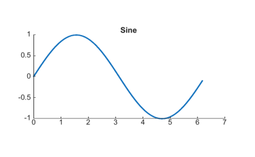

# uiaxes

Crée des axes pour les applications de style App Designer.

## 📝 Syntaxe

- ax = uiaxes()
- ax = uiaxes(parent)
- ax = uiaxes(..., propertyName, propertyValue)

## 📥 Argument d'entrée

- parent - parent container.
- propertyName, propertyValue - name-value pairs.

## 📤 Argument de sortie

- ax - axes object.

## 📄 Description


<b>ax = uiaxes</b> crée des axes adaptés aux applications basées sur uifigure et retourne l'objet axes. Se comporte comme <b>axes</b> avec les défauts UIAxes : <b>Units</b> = 'pixels', <b>Position</b> = [10 10 400 300], <b>NextPlot</b> = 'replacechildren', <b>FontUnits</b> = 'pixels'. Passez les axes aux fonctions de tracé : <b>plot(ax, ...)</b>.

## 💡 Exemples

Capture du composant UI pour l'image d'aide.

```matlab
f = uifigure('Visible', 'off', 'Name', 'Axes UI', 'Position', [100 100 420 260]);
f.HandleVisibility = 'on';
ax = uiaxes(f, 'Position', [45 45 330 175]);
x = 0:0.1:2*pi;
plot(ax, x, sin(x), 'LineWidth', 1.5);
title(ax, 'Sine');
drawnow();
```

uiaxes

```matlab

f = uifigure();
ax = uiaxes(f, 'Position', [30 30 400 300]);
plot(ax, 1:10, (1:10).^2);

```


## 🔗 Voir aussi

[uifigure](../../../gui/uifigure.md).

## 🕔 Historique

| Version | 📄 Description     |
| ------- | --------------- |
| 2.0.0   | version initiale |

<!--
## 👤 Auteur

Allan CORNET
-->
