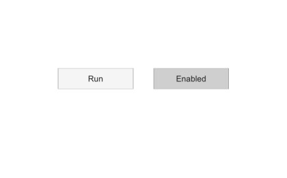

# uibutton

Crée un bouton poussoir ou un bouton à état.

## 📝 Syntaxe

- btn = uibutton()
- btn = uibutton(style)
- btn = uibutton(parent)
- btn = uibutton(parent, style)
- btn = uibutton(..., propertyName, propertyValue)

## 📥 Argument d'entrée

- parent - figure créée avec uifigure, ou objet graphique figure.
- style - style du bouton : 'push' (défaut) ou 'state'.
- propertyName - nom de propriété : chaîne de caractères.
- propertyValue - valeur de propriété : valeur compatible avec le nom de propriété.

## 📤 Argument de sortie

- btn - un objet Button ou StateButton.

## 📄 Description


<b>btn = uibutton</b> crée un bouton poussoir dans une nouvelle figure et retourne l'objet Button. Nelson appelle la fonction uifigure pour créer la figure. 

<b>btn = uibutton(style)</b> crée un bouton du style spécifié : <b>'push'</b> crée un bouton poussoir (objet Button, callback <b>ButtonPushedFcn</b>), <b>'state'</b> crée un bouton à état (objet StateButton, avec une <b>Value</b> booléenne et un callback <b>ValueChangedFcn</b>). 

<b>btn = uibutton(parent)</b> crée le bouton dans le conteneur parent spécifié. 

<b>btn = uibutton(..., propertyName, propertyValue)</b> spécifie les propriétés par paires nom-valeur : <b>Text</b>, <b>Icon</b>, <b>IconAlignment</b>, <b>HorizontalAlignment</b>, <b>VerticalAlignment</b>, <b>WordWrap</b>, <b>FontName</b>, <b>FontSize</b>, <b>FontWeight</b>, <b>FontAngle</b>, <b>FontColor</b>, <b>BackgroundColor</b>, <b>Enable</b>, <b>Visible</b>, <b>Tooltip</b>, <b>Position</b>, <b>ButtonPushedFcn</b> (push), <b>Value</b> et <b>ValueChangedFcn</b> (state), ...

## 💡 Exemples

Capture du composant UI pour l'image d'aide.

```matlab
f = uifigure('Visible', 'off', 'Name', 'Buttons', 'Position', [100 100 420 260]);
btn = uibutton(f, 'Text', 'Run', 'Position', [85 130 110 30]);
sb = uibutton(f, 'state', 'Text', 'Enabled', 'Value', true, 'Position', [225 130 110 30]);
drawnow();
```

Bouton poussoir avec callback

```matlab

f = uifigure();
btn = uibutton(f, 'Text', 'Cliquez', 'Position', [100 100 100 22], 'ButtonPushedFcn', @(src, event) disp('appuyé'))

```
Bouton à état

```matlab

f = uifigure();
sb = uibutton(f, 'state', 'Text', 'Activer option', 'Value', true)

```


## 🔗 Voir aussi

[uilabel](../../../graphics/2_graphics_objects/3_ui_controls/uilabel.md), [uifigure](../../../gui/uifigure.md), [uicontrol](../../../graphics/2_graphics_objects/3_ui_controls/uicontrol.md).

## 🕔 Historique

| Version | 📄 Description     |
| ------- | --------------- |
| 2.0.0   | version initiale |

<!--
## 👤 Auteur

Allan CORNET
-->
