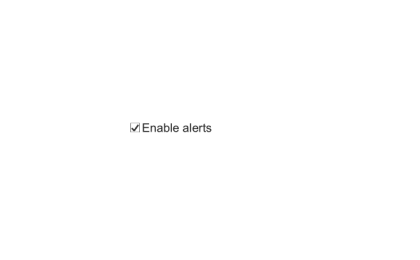

# uicheckbox

Crée une case à cocher.

## 📝 Syntaxe

- h = uicheckbox()
- h = uicheckbox(parent)
- h = uicheckbox(..., propertyName, propertyValue)

## 📥 Argument d'entrée

- parent - conteneur parent.
- propertyName, propertyValue - paires nom-valeur.

## 📤 Argument de sortie

- h - objet composant UI.

## 📄 Description


<b>cbx = uicheckbox</b> crée une case à cocher avec une <b>Value</b> logique, un libellé <b>Text</b>, <b>WordWrap</b>, les polices et un callback <b>ValueChangedFcn</b> (event : <b>Value</b>, <b>PreviousValue</b>).

## 💡 Exemples

Capture du composant UI pour l'image d'aide.

```matlab
f = uifigure('Visible', 'off', 'Name', 'Check box', 'Position', [100 100 420 260]);
cb = uicheckbox(f, 'Text', 'Enable alerts', 'Value', true, 'Position', [130 120 170 24]);
drawnow();
```

uicheckbox

```matlab

f = uifigure();
cbx = uicheckbox(f, 'Text', 'Accepter', 'Value', true, 'ValueChangedFcn', @(s, e) disp(e.Value));

```


## 🔗 Voir aussi

[uifigure](../../../gui/uifigure.md).

## 🕔 Historique

| Version | 📄 Description     |
| ------- | --------------- |
| 2.0.0   | version initiale |

<!--
## 👤 Auteur

Allan CORNET
-->
