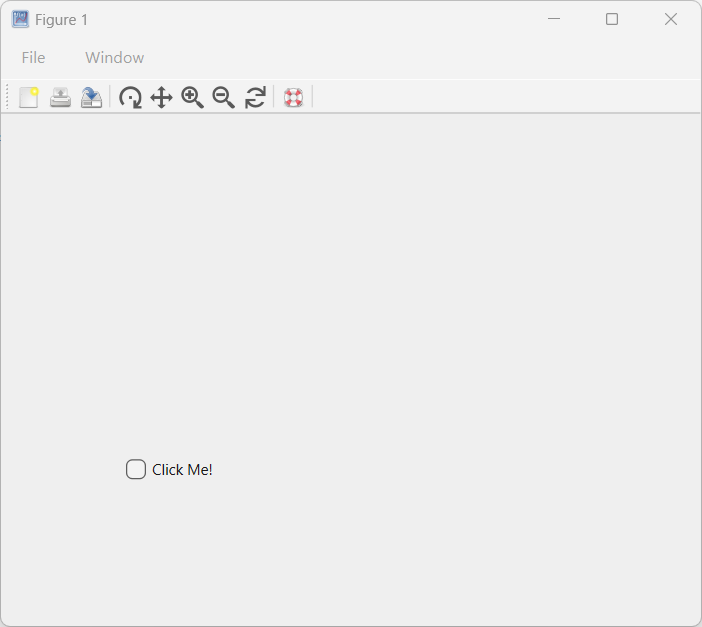
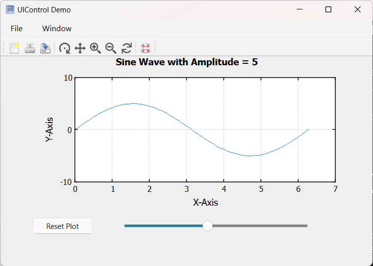

# uicontrol

Créer un composant d'interface utilisateur.

## 📝 Syntaxe

- c = uicontrol()
- c = uicontrol(propertyName, propertyValue)
- c = uicontrol(parent)
- c = uicontrol(parent, propertyName, propertyValue, ...)
- uicontrol(c)

## 📥 Argument d'entrée

- parent - Objet graphique de type figure.
- propertyName - Nom de la propriété : une chaîne scalaire ou un vecteur ligne de caractères.
- propertyValue - Valeur de la propriété : une valeur compatible avec le nom de la propriété.
- c - Un objet de contrôle d'interface utilisateur.

## 📤 Argument de sortie

- c - Un objet de contrôle d'interface utilisateur.

## 📄 Description


<b>c = uicontrol</b> crée un bouton poussoir, qui est le contrôle d'interface utilisateur par défaut, dans la figure actuelle et retourne l'objet uicontrol associé. Si aucune figure n'est actuellement ouverte, Nelson en génère une à l'aide de la fonction figure. 

<b>c = uicontrol(propertyName, propertyValue)</b> crée un contrôle d'interface utilisateur avec des propriétés définies par un ou plusieurs arguments nom-valeur. Par exemple, spécifier 'Style', 'button' créera un bouton. 

<b>c = uicontrol(parent)</b> crée le contrôle d'interface utilisateur par défaut (bouton poussoir) dans le conteneur parent spécifié, au lieu de se baser sur la figure actuelle. 

<b>c = uicontrol(parent, propertyName, propertyValue)</b> crée un contrôle d'interface utilisateur dans le conteneur parent spécifié, permettant de définir ses propriétés à l'aide d'un ou plusieurs arguments nom-valeur. 

<b>uicontrol(c)</b> met le focus sur un contrôle d'interface utilisateur précédemment défini, le plaçant au premier plan pour l'interaction utilisateur. 

 

Voir [proprietes de uicontrol](../../../graphics/2_graphics_objects/4_properties/nelson.graphics.uicontrol.properties.md) pour la liste complete des proprietes.

## 💡 Exemples

Bouton poussoir

```matlab

f = figure;
b = uicontrol(f,'Style','pushbutton', 'String', 'Cliquez-moi', 'Position', [100 100 60 30], 'Callback', 'disp(''Bonjour tout le monde!'')')

```

Case à cocher

```matlab

f = figure();
h = uicontrol(Style='checkbox', String='Cliquez-moi!', Position=[100, 100, 100, 50]);

```

Édition

```matlab

f = figure();
h = uicontrol(Style='edit', String='Cliquez-moi!', Position=[100, 100, 100, 50]);

```

Image

```matlab

hFig = figure(Position=[100, 100, 300, 300]);
imgSize = 50;  % Taille de l'image
[X, Y] = meshgrid(1:imgSize, 1:imgSize);
CData = cat(3, X/imgSize, Y/imgSize, zeros(imgSize));
CData = im2double(CData);  % S'assurer que l'image est de type double
hButton = uicontrol(Style='pushbutton',  Position=[100, 100, 100, 100], CData=CData, String='Cliquez-moi!');

```

Démo uicontrol

```matlab

addpath([modulepath('graphics','root'), '/examples/uicontrol'])
edit uicontrol_demo
uicontrol_demo

```

Démo uicontrol Interruptible

```matlab

addpath([modulepath('graphics','root'), '/examples/uicontrol'])
edit uicontrol_demo_interruptible
uicontrol_demo_interruptible

```


## 🔗 Voir aussi

[proprietes de uicontrol](../../../graphics/2_graphics_objects/4_properties/nelson.graphics.uicontrol.properties.md), [figure](../../../graphics/2_graphics_objects/1_object_management/figure.md), [Gérer les interruptions de callback dans Nelson](../../../graphics/3_labels_styling/3_interactions_camera_lighting/graphical_callback.md).

## 🕔 Historique

| Version | 📄 Description     |
| ------- | --------------- |
| 1.7.0   | Version initiale |
| 1.14.0   | Propriété Units ajoutée |

<!--
## 👤 Auteur

Allan CORNET
-->
