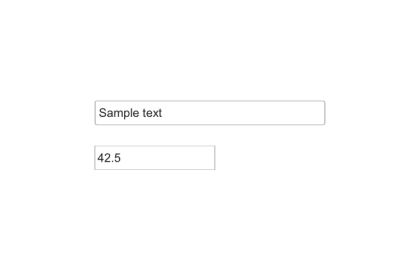

# uieditfield

Crée un champ d'édition texte ou numérique.

## 📝 Syntaxe

- h = uieditfield()
- h = uieditfield(parent)
- h = uieditfield(..., propertyName, propertyValue)

## 📥 Argument d'entrée

- parent - conteneur parent.
- propertyName, propertyValue - paires nom-valeur.

## 📤 Argument de sortie

- h - objet composant UI.

## 📄 Description

<b>ef = uieditfield</b> crée un champ texte ; <b>uieditfield(parent, 'numeric')</b> crée un champ numérique. Style texte : <b>Value</b> (char), <b>CharacterLimits</b>, <b>InputType</b>, <b>ValueChangingFcn</b>. Style numérique : <b>Value</b> (double), <b>Limits</b>, <b>LowerLimitInclusive</b>/<b>UpperLimitInclusive</b>, <b>RoundFractionalValues</b>, <b>ValueDisplayFormat</b>, <b>AllowEmpty</b>. Communs : <b>Editable</b>, <b>HorizontalAlignment</b>, <b>Placeholder</b>, <b>ValueChangedFcn</b>.

## 💡 Exemples

Capture du composant UI pour l'image d'aide.

```matlab
f = uifigure('Visible', 'off', 'Name', 'Edit fields', 'Position', [100 100 420 260]);
ef = uieditfield(f, 'Position', [95 135 230 24]);
ef.Value = 'Sample text';
nf = uieditfield(f, 'numeric', 'Position', [95 90 120 24]);
nf.Value = 42.5;
drawnow();
```


uieditfield

```matlab

f = uifigure();
ef = uieditfield(f, 'Value', 'bonjour');
nef = uieditfield(f, 'numeric', 'Limits', [0 100], 'Value', 42);

```

## 🔗 Voir aussi

[uifigure](../../../gui/uifigure.md).

## 🕔 Historique

| Version | 📄 Description   |
| ------- | ---------------- |
| 2.0.0   | version initiale |

<!--
## 👤 Auteur

Allan CORNET
-->
