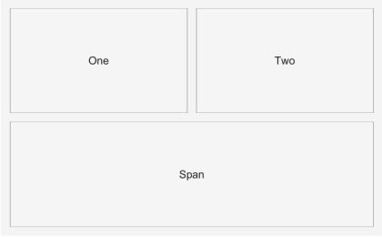

# uigridlayout

Crée un gestionnaire de disposition en grille.

## 📝 Syntaxe

- h = uigridlayout()
- h = uigridlayout(parent)
- h = uigridlayout(..., propertyName, propertyValue)

## 📥 Argument d'entrée

- parent - conteneur parent (uifigure, figure, uipanel, uitab, uibuttongroup, uigridlayout).
- propertyName, propertyValue - paires nom-valeur.

## 📤 Argument de sortie

- h - objet conteneur.

## 📄 Description

<b>g = uigridlayout</b> crée un gestionnaire de disposition qui positionne ses enfants dans une grille configurable. <b>g = uigridlayout(parent, [r c])</b> crée une grille r par c. <b>RowHeight</b> et <b>ColumnWidth</b> acceptent des tailles fixes en pixels, des tailles pondérées ('1x', '2x', ...) et 'fit'. Les enfants sont placés via leurs options <b>Layout.Row</b> / <b>Layout.Column</b> (scalaire ou intervalle [début fin]) ; les composants ajoutés sans placement explicite remplissent la grille de gauche à droite puis de haut en bas. Autres propriétés : <b>RowSpacing</b>, <b>ColumnSpacing</b>, <b>Padding</b>, <b>BackgroundColor</b>, <b>Scrollable</b>.

## 💡 Exemples

Capture du composant UI pour l'image d'aide.

```matlab
f = uifigure('Visible', 'off', 'Name', 'Grid layout', 'Position', [100 100 420 260]);
g = uigridlayout(f, [2 2]);
b1 = uibutton(g, 'Text', 'One');
b2 = uibutton(g, 'Text', 'Two');
b3 = uibutton(g, 'Text', 'Span');
b3.Layout.Row = 2;
b3.Layout.Column = [1 2];
drawnow();
```


uigridlayout

```matlab

f = uifigure();
g = uigridlayout(f, [2 2]);
b1 = uibutton(g, 'Text', 'Un');
b2 = uibutton(g, 'Text', 'Deux');
b3 = uibutton(g, 'Text', 'Fusion');
b3.Layout.Column = [1 2];
g.RowHeight = {22, '1x'};

```

## 🔗 Voir aussi

[uifigure](../../../gui/uifigure.md).

## 🕔 Historique

| Version | 📄 Description   |
| ------- | ---------------- |
| 2.0.0   | version initiale |

<!--
## 👤 Auteur

Allan CORNET
-->
