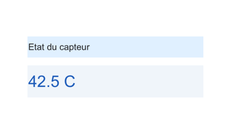

# uilabel

Crée un composant étiquette (label).

## 📝 Syntaxe

- lbl = uilabel()
- lbl = uilabel(parent)
- lbl = uilabel(..., propertyName, propertyValue)

## 📥 Argument d'entrée

- parent - figure créée avec uifigure, ou objet graphique figure.
- propertyName - nom de propriété : chaîne de caractères.
- propertyValue - valeur de propriété : valeur compatible avec le nom de propriété.

## 📤 Argument de sortie

- lbl - un objet Label.

## 📄 Description

<b>lbl = uilabel</b> crée une étiquette dans une nouvelle figure et retourne l'objet Label. Nelson appelle la fonction uifigure pour créer la figure.

<b>lbl = uilabel(parent)</b> crée l'étiquette dans le conteneur parent spécifié.

<b>lbl = uilabel(..., propertyName, propertyValue)</b> spécifie les propriétés par paires nom-valeur : <b>Text</b>, <b>Interpreter</b>, <b>HorizontalAlignment</b>, <b>VerticalAlignment</b>, <b>WordWrap</b>, <b>FontName</b>, <b>FontSize</b>, <b>FontWeight</b>, <b>FontAngle</b>, <b>FontColor</b>, <b>BackgroundColor</b>, <b>Enable</b>, <b>Visible</b>, <b>Tooltip</b>, <b>Position</b>, ...

## 💡 Exemples

Capture du composant UI pour l'image d'aide.

```matlab
f = uifigure('Visible', 'off', 'Name', 'Labels', 'Position', [100 100 460 280]);
titleLabel = uilabel(f, 'Text', 'Etat du capteur', 'FontSize', 18, 'FontWeight', 'bold', 'BackgroundColor', [0.88 0.94 1.00], 'Position', [55 165 350 42]);
valueLabel = uilabel(f, 'Text', '42.5 C', 'FontSize', 32, 'FontWeight', 'bold', 'FontColor', [0.10 0.35 0.72], 'HorizontalAlignment', 'center', 'BackgroundColor', [0.94 0.96 0.98], 'Position', [55 85 350 64]);
drawnow();
```


Étiquette dans une uifigure

```matlab

f = uifigure();
lbl = uilabel(f, 'Text', 'Résultat :', 'Position', [100 100 100 22], 'FontWeight', 'bold')

```

## 🔗 Voir aussi

[uibutton](../../../graphics/uibutton.md), [uifigure](../../../gui/uifigure.md).

## 🕔 Historique

| Version | 📄 Description   |
| ------- | ---------------- |
| 2.0.0   | version initiale |

<!--
## 👤 Auteur

Allan CORNET
-->
