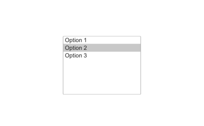

# uilistbox

Crée une liste de sélection.

## 📝 Syntaxe

- h = uilistbox()
- h = uilistbox(parent)
- h = uilistbox(..., propertyName, propertyValue)

## 📥 Argument d'entrée

- parent - conteneur parent.
- propertyName, propertyValue - paires nom-valeur.

## 📤 Argument de sortie

- h - objet composant UI.

## 📄 Description


<b>lb = uilistbox</b> crée une liste. <b>Items</b>/<b>ItemsData</b> suivent les règles de la liste déroulante ; <b>Multiselect</b> 'on' autorise la sélection multiple (<b>Value</b> cell). Callback <b>ValueChangedFcn</b> (event : <b>Value</b>, <b>PreviousValue</b>, <b>ValueIndex</b>, <b>PreviousValueIndex</b>).

## 💡 Exemples

Capture du composant UI pour l'image d'aide.

```matlab
f = uifigure('Visible', 'off', 'Name', 'List box', 'Position', [100 100 420 260]);
lb = uilistbox(f, 'Items', {'Option 1', 'Option 2', 'Option 3'}, 'Position', [130 65 160 120]);
lb.Value = 'Option 2';
drawnow();
```

uilistbox

```matlab

f = uifigure();
lb = uilistbox(f, 'Items', {'Item 1', 'Item 2', 'Item 3'}, 'Multiselect', 'on');
lb.Value = {'Item 1', 'Item 3'};

```


## 🔗 Voir aussi

[uifigure](../../../gui/uifigure.md).

## 🕔 Historique

| Version | 📄 Description     |
| ------- | --------------- |
| 2.0.0   | version initiale |

<!--
## 👤 Auteur

Allan CORNET
-->
