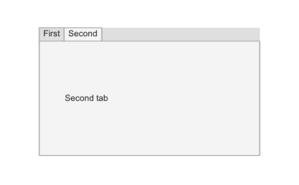

# uitabgroup

Crée un groupe d'onglets.

## 📝 Syntaxe

- h = uitabgroup()
- h = uitabgroup(parent)
- h = uitabgroup(..., propertyName, propertyValue)

## 📥 Argument d'entrée

- parent - conteneur parent (uifigure, figure, uipanel, uitab, uibuttongroup, uigridlayout).
- propertyName, propertyValue - paires nom-valeur.

## 📤 Argument de sortie

- h - objet conteneur.

## 📄 Description

<b>tg = uitabgroup</b> crée un groupe d'onglets. Les enfants sont des objets uitab. Propriétés principales : <b>TabLocation</b> ('top', 'bottom', 'left', 'right'), <b>SelectedTab</b>, <b>SelectionChangedFcn</b> (event avec <b>OldValue</b> et <b>NewValue</b>).

## 💡 Exemples

Capture du composant UI pour l'image d'aide.

```matlab
f = uifigure('Visible', 'off', 'Name', 'Tab group', 'Position', [100 100 420 260]);
tg = uitabgroup(f, 'Position', [55 40 310 180]);
t1 = uitab(tg, 'Title', 'First');
t2 = uitab(tg, 'Title', 'Second');
tg.SelectedTab = t2;
uilabel(t2, 'Text', 'Second tab', 'Position', [35 70 120 24]);
drawnow();
```


uitabgroup

```matlab

f = uifigure();
tg = uitabgroup(f, 'Position', [20 20 250 210]);
t1 = uitab(tg, 'Title', 'Premier');
t2 = uitab(tg, 'Title', 'Second');
tg.SelectedTab = t2;

```

## 🔗 Voir aussi

[uifigure](../../../gui/uifigure.md).

## 🕔 Historique

| Version | 📄 Description   |
| ------- | ---------------- |
| 2.0.0   | version initiale |

<!--
## 👤 Auteur

Allan CORNET
-->
