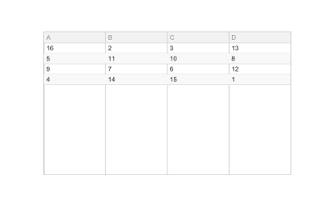

# uitable

Crée un composant table (style App Designer).

## 📝 Syntaxe

- h = uitable()
- h = uitable(parent)
- h = uitable(..., propertyName, propertyValue)

## 📥 Argument d'entrée

- parent - parent object.
- propertyName, propertyValue - name-value pairs.

## 📤 Argument de sortie

- h - UI object.

## 📄 Description

<b>t = uitable</b> crée une table. <b>Data</b> accepte des tableaux numériques, logiques ou cell. Propriétés : <b>ColumnName</b> ('numbered' ou cell), <b>RowName</b>, <b>ColumnWidth</b>, <b>ColumnEditable</b>, <b>ColumnSortable</b>, <b>ColumnFormat</b>, <b>RowStriping</b>, <b>Selection</b>/<b>SelectionType</b>/<b>Multiselect</b>, <b>DisplayData</b> (lecture seule). Callbacks : <b>CellEditCallback</b> (event : Indices, EditData, NewData), <b>SelectionChangedFcn</b>.

## 💡 Exemples

Capture du composant UI pour l'image d'aide.

```matlab
f = uifigure('Visible', 'off', 'Name', 'Table', 'Position', [100 100 420 260]);
t = uitable(f, 'Data', magic(4), 'ColumnName', {'A', 'B', 'C', 'D'}, 'Position', [55 40 310 180]);
drawnow();
```


uitable

```matlab

f = uifigure();
t = uitable(f, 'Data', magic(4), 'ColumnName', {'A', 'B', 'C', 'D'}, 'ColumnEditable', true(1, 4));

```

## 🔗 Voir aussi

[uifigure](../../../gui/uifigure.md).

## 🕔 Historique

| Version | 📄 Description  |
| ------- | --------------- |
| 2.0.0   | initial version |

<!--
## 👤 Auteur

Allan CORNET
-->
