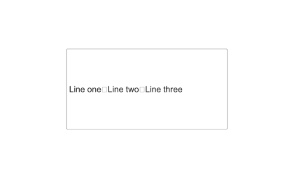

# uitextarea

Crée une zone de texte multiligne.

## 📝 Syntaxe

- h = uitextarea()
- h = uitextarea(parent)
- h = uitextarea(..., propertyName, propertyValue)

## 📥 Argument d'entrée

- parent - conteneur parent.
- propertyName, propertyValue - paires nom-valeur.

## 📤 Argument de sortie

- h - objet composant UI.

## 📄 Description

<b>ta = uitextarea</b> crée une zone de texte multiligne. <b>Value</b> est un cell array de chaînes (une par ligne). Propriétés : <b>Editable</b>, <b>WordWrap</b>, <b>HorizontalAlignment</b>, <b>Placeholder</b>, <b>ValueChangedFcn</b>, <b>ValueChangingFcn</b>.

## 💡 Exemples

Capture du composant UI pour l'image d'aide.

```matlab
f = uifigure('Visible', 'off', 'Name', 'Text area', 'Position', [100 100 420 260]);
ta = uitextarea(f, 'Position', [95 75 230 115]);
ta.Value = {'Line one'; 'Line two'; 'Line three'};
drawnow();
```


uitextarea

```matlab

f = uifigure();
ta = uitextarea(f, 'Value', {'première ligne', 'seconde ligne'});

```

## 🔗 Voir aussi

[uifigure](../../../gui/uifigure.md).

## 🕔 Historique

| Version | 📄 Description   |
| ------- | ---------------- |
| 2.0.0   | version initiale |

<!--
## 👤 Auteur

Allan CORNET
-->
