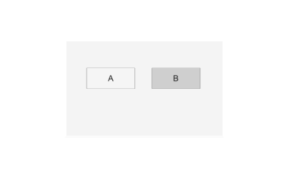

# uitogglebutton

Crée un bouton bascule dans un groupe de boutons.

## 📝 Syntaxe

- h = uitogglebutton()
- h = uitogglebutton(parent)
- h = uitogglebutton(..., propertyName, propertyValue)

## 📥 Argument d'entrée

- parent - conteneur parent.
- propertyName, propertyValue - paires nom-valeur.

## 📤 Argument de sortie

- h - objet composant UI.

## 📄 Description

<b>tb = uitogglebutton(bg)</b> crée un bouton bascule dans un uibuttongroup à sélection exclusive. Propriétés : <b>Value</b>, <b>Text</b>, <b>Icon</b>, <b>IconAlignment</b>, alignements, <b>BackgroundColor</b>, polices.

## 💡 Exemples

Capture du composant UI pour l'image d'aide.

```matlab
f = uifigure('Visible', 'off', 'Name', 'Toggle buttons', 'Position', [100 100 420 260]);
bg = uibuttongroup(f, 'Position', [95 60 230 140]);
tb1 = uitogglebutton(bg, 'Text', 'A', 'Position', [30 70 70 30]);
tb2 = uitogglebutton(bg, 'Text', 'B', 'Position', [125 70 70 30]);
tb2.Value = true;
drawnow();
```


uitogglebutton

```matlab

f = uifigure();
bg = uibuttongroup(f);
tb1 = uitogglebutton(bg, 'Text', 'A');
tb2 = uitogglebutton(bg, 'Text', 'B');

```

## 🔗 Voir aussi

[uifigure](../../../gui/uifigure.md).

## 🕔 Historique

| Version | 📄 Description   |
| ------- | ---------------- |
| 2.0.0   | version initiale |

<!--
## 👤 Auteur

Allan CORNET
-->
