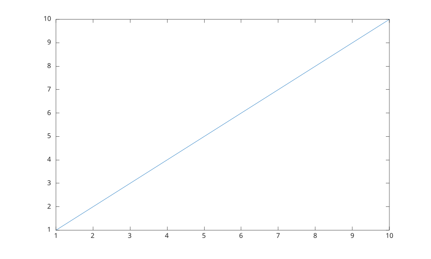

# box

Afficher ou masquer le contour d'un objet graphique.

## 📝 Syntaxe

- box
- box('on')
- box('off')
- box(visibility)
- box(target, ...)

## 📥 Argument d'entrée

- visibility - Visibilite du contour : 'on', 'off', true, false, 1 ou 0.
- target - Objet cible avec une propriete Box, comme des axes, une legende ou une colorbar.

## 📄 Description

<b>box()</b> active ou desactive le contour des axes courants.

<b>box('on')</b> affiche le contour des axes courants.

<b>box('off')</b> masque le contour des axes courants.

<b>box(target, ...)</b> modifie le contour de la cible specifiee au lieu des axes courants.

## 💡 Exemple

```matlab
f = figure();
plot(1:10)
box on
```



## 🔗 Voir aussi

[axes](../../../graphics/2_graphics_objects/1_object_management/axes.md), [grid](../../../graphics/3_labels_styling/1_axes_appearance/grid.md), [legend](../../../graphics/3_labels_styling/4_labels_annotations/legend.md), [colorbar](../../../graphics/3_labels_styling/4_labels_annotations/colorbar.md).

## 🕔 Historique

| Version | 📄 Description   |
| ------- | ---------------- |
| 2.0.0   | version initiale |

<!--
## 👤 Auteur

Allan CORNET
-->
