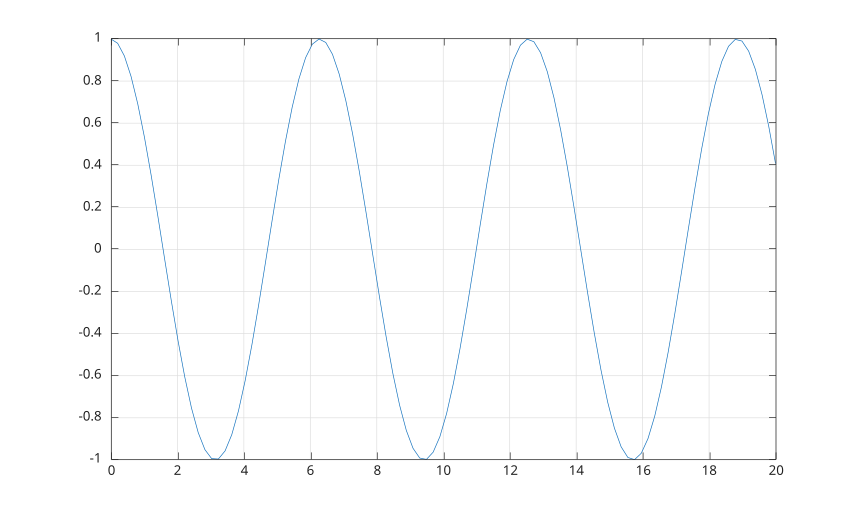

# grid

Afficher ou masquer les lignes de grille des axes.

## 📝 Syntaxe

- grid
- grid('on')
- grid('off')
- grid('minor')
- grid(ax, ...)

## 📥 Argument d'entrée

- 'on' - affiche la grille principale.
- 'off' - supprime toutes les lignes de grille.
- 'minor' - active ou désactive la visibilité des lignes de grille mineures.
- ax - Objet cible : axes.

## 📄 Description


<b>grid()</b> active ou désactive la visibilité des lignes de grille principales.

## 💡 Exemple


```matlab
f = figure();
x = linspace(0, 20);
y = cos(x);
plot(x, y)
grid on
```



## 🔗 Voir aussi

[axes](../../../graphics/2_graphics_objects/1_object_management/axes.md), [plot](../../../graphics/1_plots/1_line_plots/plot.md).

## 🕔 Historique

| Version | 📄 Description     |
| ------- | --------------- |
| 1.0.0   | version initiale |

<!--
## 👤 Auteur

Allan CORNET
-->
