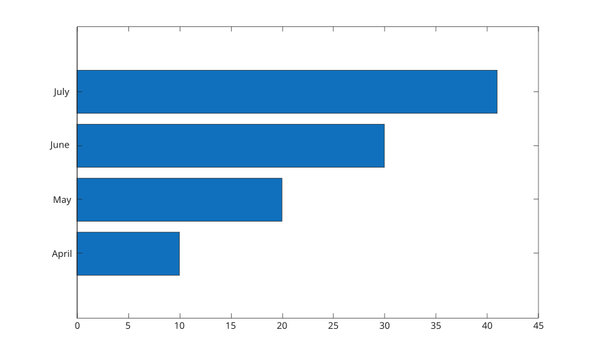

# yticklabels

Definir ou interroger les etiquettes des graduations de l'axe y.

## 📝 Syntaxe

- yticklabels(labels)
- yticklabels('auto')
- yticklabels('manual')
- mode = yticklabels('mode')
- labels = yticklabels
- yticklabels(ax, ...)
- labels = yticklabels(ax)

## 📥 Argument d'entrée

- labels - tableau de chaines, cellule de vecteurs de caracteres, ou vecteur de caracteres utilise comme etiquettes de graduations de l'axe y.
- ax - objet axes cible. S'il est omis, les axes courants sont utilises.

## 📤 Argument de sortie

- labels - etiquettes courantes des graduations de l'axe y.
- mode - mode courant des etiquettes de l'axe y : 'auto' ou 'manual'.

## 📄 Description

<b>yticklabels</b> definit ou interroge la propriete <b>YTickLabel</b> des axes.

Affecter des etiquettes passe <b>YTickLabelMode</b> a <b>manual</b>. Utiliser <b>yticklabels('auto')</b> pour revenir aux etiquettes automatiques.

## 💡 Exemples

Definir les etiquettes de l'axe y pour un diagramme en barres horizontales.

```matlab
f = figure();
barh([10 20 30 41]);
yticklabels({'April', 'May', 'June', 'July'});

```


Definir des etiquettes sur des axes specifies et interroger le mode.

```matlab
f = figure();
ax = axes('Parent', f);
plot(ax, 1:4, [2 4 3 5]);
ax.YTick = 2:5;
yticklabels(ax, ["low"; "mid"; "high"; "top"]);
mode = yticklabels(ax, 'mode')

```

## 🔗 Voir aussi

[axes](../../../graphics/2_graphics_objects/1_object_management/axes.md), [barh](../../../graphics/1_plots/6_discrete_data_plots/barh.md).

<!--
## 👤 Auteur

Allan CORNET
-->
