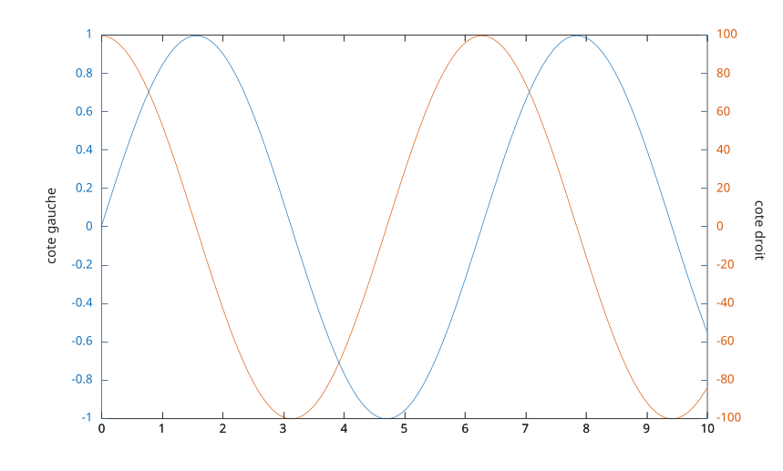

# yyaxis

Cree ou selectionne un axe avec deux axes y.

## 📝 Syntaxe

- yyaxis left
- yyaxis right
- yyaxis(ax, 'left')
- yyaxis(ax, 'right')

## 📥 Argument d'entrée

- 'left' - Active le cote gauche. Les nouveaux traces sont ajoutes a l'axe y de gauche.
- 'right' - Active le cote droit. Les nouveaux traces sont ajoutes a l'axe y de droite.
- ax - Axe cible : axes.

## 📄 Description


<b>yyaxis</b> cree un graphique avec deux axes y et selectionne le cote actif. Si l'axe courant n'a pas encore deux axes y, un second est ajoute ; s'il n'y a pas d'axe courant, il est cree. 

Les deux cotes partagent le meme axe x mais chacun possede ses propres limites, couleur, echelle, direction, graduations, etiquette et enfants. Les proprietes dont le nom commence par <b>Y</b> (comme <b>YLim</b>, <b>YColor</b> ou <b>YLabel</b>) s'appliquent uniquement au cote actif. Interrogez <b>YAxisLocation</b> pour savoir quel cote est actif. 

Par defaut, la regle de gauche utilise la premiere couleur du <b>ColorOrder</b> de l'axe et la regle de droite la deuxieme couleur. 

Les deux regles sont aussi disponibles comme objets via la propriete <b>YAxis</b> de l'axe : <b>YAxis(1)</b> est la regle de gauche et <b>YAxis(2)</b> la regle de droite, quel que soit le cote actif. 

<b>cla reset</b> supprime le second axe y et revient a un seul axe y.

## 💡 Exemple


```matlab
f = figure();
x = linspace(0, 10);
yyaxis left
plot(x, sin(x))
ylabel('cote gauche')
yyaxis right
plot(x, 100 * cos(x))
ylabel('cote droit')

```



## 🔗 Voir aussi

[hold](../../../graphics/2_graphics_objects/1_object_management/hold.md), [axis](../../../graphics/3_labels_styling/1_axes_appearance/axis.md), [ylabel](../../../graphics/3_labels_styling/4_labels_annotations/ylabel.md).

## 🕔 Historique

| Version | 📄 Description     |
| ------- | --------------- |
| 2.0.0   | initial version |

<!--
## 👤 Auteur

Allan CORNET
-->
