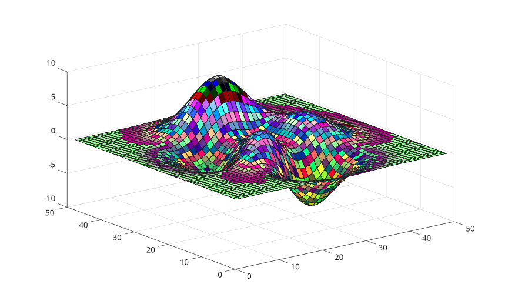

# colorcube

Tableau de colormap RGB en cube ameliore.

## 📝 Syntaxe

- c = colorcube
- c = colorcube(m)

## 📥 Argument d'entrée

- m - une valeur entiere scalaire : Nombre de couleurs (256 par defaut).

## 📤 Argument de sortie

- c - Tableau de colormap RGB en cube ameliore.

## 📄 Description

<b>colorcube</b> retourne une colormap construite avec un cube RGB, des rampes de couleurs pures, le noir et des niveaux de gris.

## 💡 Exemple

```matlab
f = figure();
surf(peaks);
colormap('colorcube');
```



## 🔗 Voir aussi

[colormap](../../../../graphics/3_labels_styling/2_color_styling/colormaps/colormap.md).

## 🕔 Historique

| Version | 📄 Description   |
| ------- | ---------------- |
| 1.15.0  | version initiale |

<!--
## 👤 Auteur

Allan CORNET
-->
