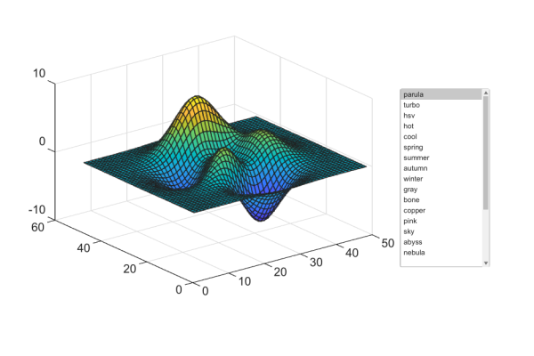

# colormaplist

Fournit la liste des palettes de couleurs.

## 📝 Syntaxe

- colormaps = colormaplist()

## 📤 Argument de sortie

- colormaps - Vecteur de chaines des palettes de couleurs disponibles.

## 📄 Description

<b>colormaplist</b> retourne les palettes de couleurs disponibles sous forme de tableau de chaines <b>m</b>-par-<b>1</b>.

## 💡 Exemple

```matlab
f = figure('Position', [100, 100, 600, 400], 'Resize', 'off');
ax = axes('Position', [0.1, 0.2, 0.6, 0.7]);
surf(ax, peaks);
cmaps = colormaplist;
listbox = uicontrol('Style', 'listbox', 'Position', [450, 100, 100, 200], 'String', cmaps);
listbox.Callback = @(src, void) colormap(ax, cmaps(src.Value));

```



## 🔗 Voir aussi

[colormap](../../../../graphics/3_labels_styling/2_color_styling/colormaps/colormap.md).

## 🕔 Historique

| Version | 📄 Description   |
| ------- | ---------------- |
| 1.14.0  | version initiale |

<!--
## 👤 Auteur

Allan CORNET
-->
