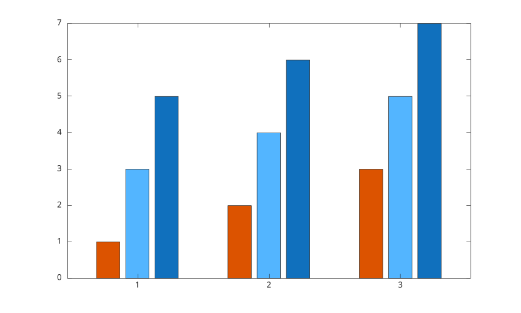

# colororder

Definir ou interroger l'ordre des couleurs des axes.

## 📝 Syntaxe

- colororder(colors)
- colororder(name)
- colororder(ax, ...)
- colors = colororder
- colors = colororder(ax)

## 📥 Argument d'entrée

- colors - matrice numerique reelle n-par-3 contenant des valeurs de couleurs RGB.
- name - ordre de couleurs nomme : 'default', 'gem', 'glow', 'sail', 'reef', 'meadow', 'dye' ou 'earth'.
- ax - objet axes cible. S'il est omis, les axes courants sont utilises.

## 📤 Argument de sortie

- colors - ordre des couleurs courant des axes, sous forme de matrice RGB n-par-3.

## 📄 Description

<b>colororder</b> definit ou interroge la propriete <b>ColorOrder</b> des axes.

Definir un ordre de couleurs remet <b>ColorOrderIndex</b> a 1. Les objets bar dont la couleur de face est automatique sont mis a jour avec le nouvel ordre.

## 💡 Exemples

Utiliser un ordre de couleurs nomme pour des barres groupees.

```matlab
f = figure();
colororder('reef');
bar([1 3 5; 2 4 6; 3 5 7]);

```


Definir un ordre de couleurs RGB personnalise.

```matlab
f = figure();
ax = axes('Parent', f);
colororder(ax, [0.8 0.1 0.1; 0.1 0.5 0.9; 0.2 0.7 0.2]);
y = [1:5; 2:6; 3:7]';
plot(ax, 1:5, y);

```


## 🔗 Voir aussi

[axes](../../../graphics/2_graphics_objects/1_object_management/axes.md), [bar](../../../graphics/1_plots/6_discrete_data_plots/bar.md), [plot](../../../graphics/1_plots/1_line_plots/plot.md).

<!--
## 👤 Auteur

Allan CORNET
-->
