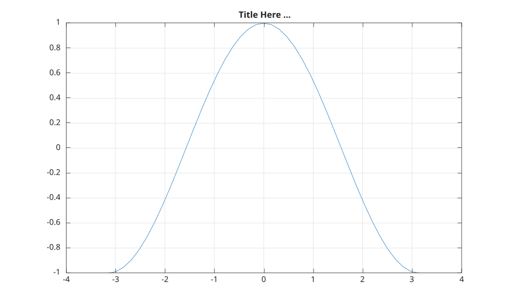

# drawnow

Met à jour les figures et traite les callbacks

## 📝 Syntaxe

- drawnow()
- drawnow('limitrate')
- drawnow limitrate

## 📥 Argument d'entrée

- limitrate - Limite les mises à jour des figures pour réduire le travail de rendu pendant les boucles d'animation.

## 📄 Description

<b>drawnow</b> vide la file d'attente des événements et met à jour la fenêtre de la figure.

<b>drawnow('limitrate')</b> et <b>drawnow limitrate</b> traitent les callbacks en attente mais ignorent la mise à jour des figures lorsque la mise à jour précédente est récente. Ce mode est utile dans les boucles d'animation.

## 💡 Exemples

```matlab
x = -pi:pi/20:pi;
plot(x, cos(x))
drawnow
title('Title Here ...')
grid on
```



```matlab
x = linspace(0, 2*pi, 200);
h = plot(x, sin(x));
for k = 1:20
  set(h, 'YData', sin(x + k / 10));
  drawnow limitrate
end
```

## 🔗 Voir aussi

[refresh](../../../graphics/3_labels_styling/3_interactions_camera_lighting/refresh.md).

## 🕔 Historique

| Version | 📄 Description   |
| ------- | ---------------- |
| 1.0.0   | version initiale |

<!--
## 👤 Auteur

Allan CORNET
-->
