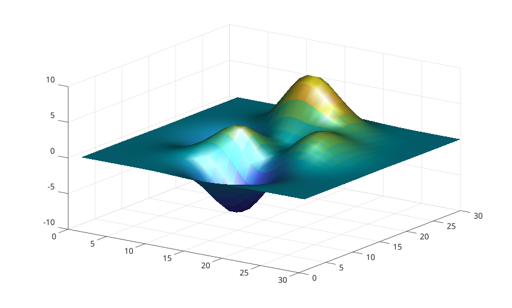

# lightangle

Cree ou positionne une lumiere a partir d'angles.

## 📝 Syntaxe

- lightangle(az, el)
- lightangle(ax, az, el)
- lightangle(go, az, el)
- go = lightangle(...)

## 📄 Description

<b>lightangle</b> convertit un azimut et une elevation en position de lumiere.

## 💡 Exemple

```matlab

surf(peaks(30), 'EdgeColor', 'none', 'FaceLighting', 'gouraud');
lightangle(45, 30);
material('shiny');
view(35, 28);

```



## 🔗 Voir aussi

[light](../../../graphics/3_labels_styling/3_interactions_camera_lighting/light.md), [camlight](../../../graphics/3_labels_styling/3_interactions_camera_lighting/camlight.md).

## 🕔 Historique

| Version | 📄 Description   |
| ------- | ---------------- |
| 2.0.0   | version initiale |

<!--
## 👤 Auteur

Allan CORNET
-->
