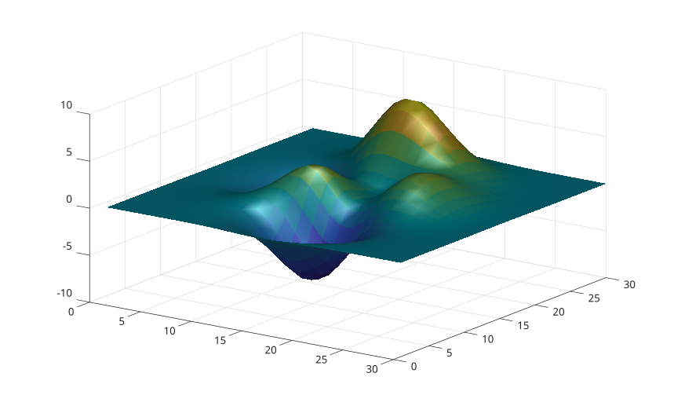

# material

Definit les proprietes de materiau.

## 📝 Syntaxe

- material(name)
- material(ax, name)
- material(values)

## 📥 Argument d'entrée

- name - <b>default</b>, <b>shiny</b>, <b>dull</b> ou <b>metal</b>.
- values - Quatre ou cinq coefficients de materiau.

## 📄 Description

<b>material</b> modifie les coefficients ambiant, diffus, speculaire, exposant et reflectance.

## 💡 Exemple

```matlab

surf(peaks(30), 'EdgeColor', 'none', 'FaceLighting', 'gouraud');
light('Position', [1 -1 1]);
lighting gouraud;
material('metal');
view(35, 28);

```



## 🔗 Voir aussi

[light](../../../graphics/3_labels_styling/3_interactions_camera_lighting/light.md), [lighting](../../../graphics/3_labels_styling/3_interactions_camera_lighting/lighting.md).

## 🕔 Historique

| Version | 📄 Description   |
| ------- | ---------------- |
| 2.0.0   | version initiale |

<!--
## 👤 Auteur

Allan CORNET
-->
