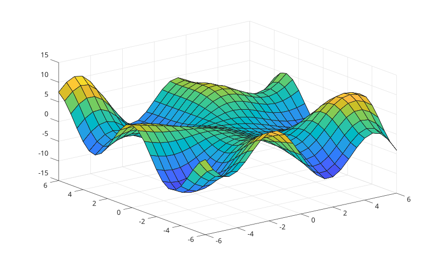
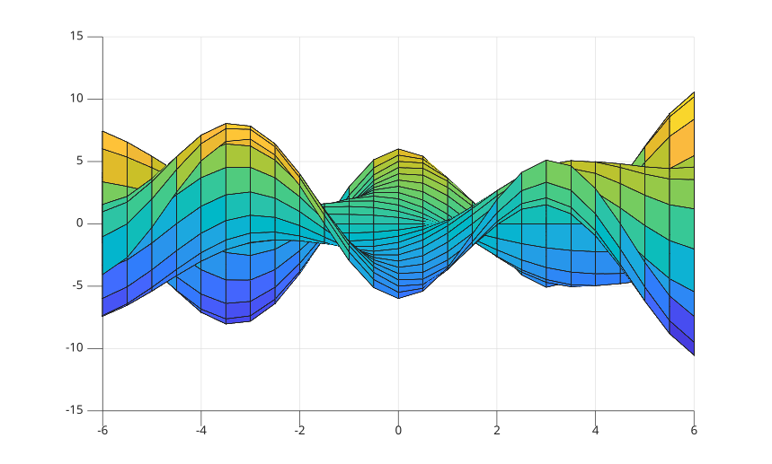
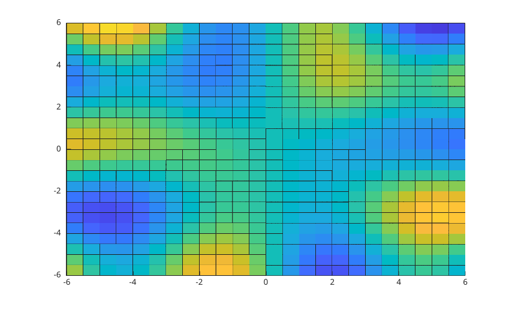

# view

Ligne de visée de la caméra.

## 📝 Syntaxe

- view(az, el)
- view([az, el])
- view([x, y, z])
- view(dim)
- view(ax, ...)
- [az, el] = view(...)

## 📥 Argument d'entrée

- dim - Dimensions : 2 équivaut à view(0, 90) ou 3 équivaut à view(-37.5, 30).
- az - Azimut : scalaire
- el - Élévation : scalaire
- ax - Un objet graphique scalaire : conteneur parent, spécifié comme axes.

## 📄 Description

<b>view</b> définit la vue dans un tracé.

## 💡 Exemples

```matlab
f = figure();
[X,Y] = meshgrid(-6:.5:6);
Z = Y .* sin(X) - X .* cos(Y);
surf(X, Y, Z)
```



```matlab
f = figure();
[X,Y] = meshgrid(-6:.5:6);
Z = Y .* sin(X) - X .* cos(Y);
surf(X, Y, Z)
view(90, 0)
```



```matlab
f = figure();
[X,Y] = meshgrid(-6:.5:6);
Z = Y .* sin(X) - X .* cos(Y);
surf(X, Y, Z)
view(2)
```



## 🔗 Voir aussi

[axes](../../../graphics/2_graphics_objects/1_object_management/axes.md).

## 🕔 Historique

| Version | 📄 Description                                 |
| ------- | ---------------------------------------------- |
| 1.0.0   | Version initiale                               |
| 1.2.0   | Azimut et élévation comme arguments de sortie. |

<!--
## 👤 Auteur

Allan CORNET
-->
