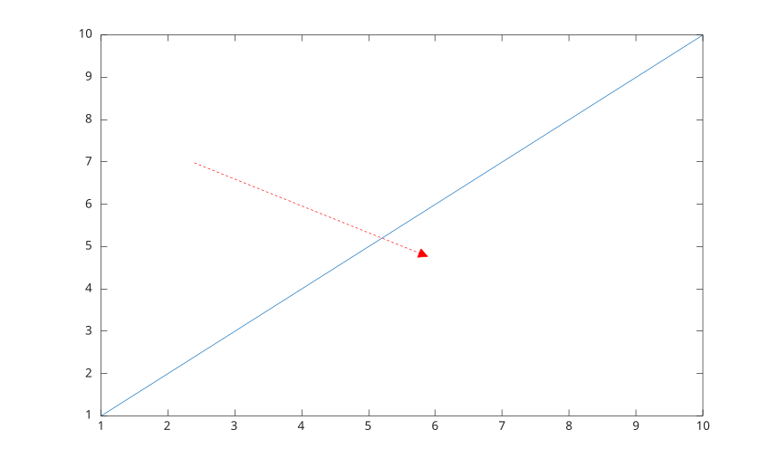
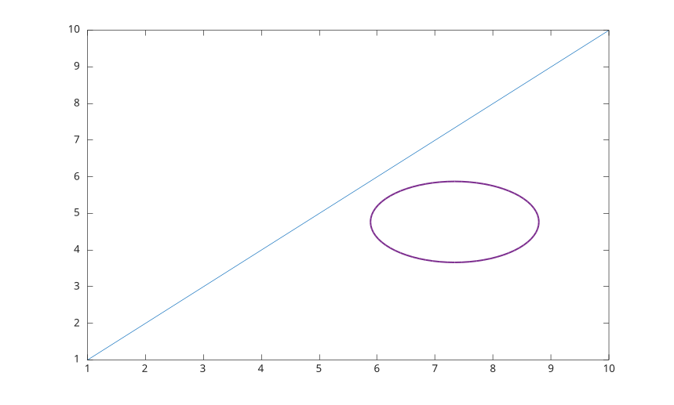

# annotation

Creer des annotations de figure.

## 📝 Syntaxe

- annotation(lineType, x, y)
- annotation(lineType)
- annotation(shapeType, dim)
- annotation(shapeType)
- annotation(..., propertyName, propertyValue)
- annotation(fig, ...)
- go = annotation(...)

## 📥 Argument d'entrée

- lineType - 'line', 'arrow', 'doublearrow' ou 'textarrow'.
- shapeType - 'rectangle', 'ellipse' ou 'textbox'.
- x, y - Vecteurs a deux elements qui definissent les coordonnees de debut et de fin.
- dim - Vecteur a quatre elements [x y w h].
- fig - Figure cible.

## 📤 Argument de sortie

- go - Objet graphique annotation.

## 📄 Description


<b>annotation</b> cree des annotations dans les coordonnees de la figure. Les unites par defaut sont normalisees. 

Les unites prises en charge sont 'normalized', 'inches', 'centimeters', 'characters', 'points' et 'pixels'. 

Les rectangles et ellipses prennent en charge Position, Rotation, Units, Color, FaceColor, LineStyle et LineWidth. Rectangle prend aussi en charge FaceAlpha. 

Voir [proprietes de annotation](../../../graphics/2_graphics_objects/4_properties/nelson.graphics.annotation.properties.md) pour la liste complete des proprietes.

## 💡 Exemples

Ajouter une annotation line.

```matlab

f = figure();
plot(1:10);
annotation('line', [0.15 0.85], [0.75 0.75], ...
  'Color', [0 0.45 0.74], 'LineWidth', 2);

```

Ajouter une annotation arrow.

```matlab

f = figure();
plot(1:10);
annotation('arrow', [0.25 0.55], [0.65 0.45], ...
  'Color', 'red', 'LineStyle', '--', 'HeadStyle', 'plain');

```

Ajouter une annotation doublearrow.

```matlab

f = figure();
plot(1:10);
annotation('doublearrow', [0.25 0.75], [0.25 0.25], ...
  'Head1Style', 'vback1', 'Head2Style', 'cback3', 'LineWidth', 1.5);

```

Ajouter une annotation textarrow.

```matlab

f = figure();
plot(1:10);
annotation('textarrow', [0.3 0.55], [0.7 0.55], ...
  'String', 'y = x', 'TextBackgroundColor', 'white');

```

Ajouter une annotation rectangle.

```matlab

f = figure();
plot(1:10);
annotation('rectangle', [0.3 0.4 0.25 0.2], ...
  'Color', 'red', 'FaceColor', 'yellow', 'FaceAlpha', 0.35, 'Rotation', 20);

```

Ajouter une annotation ellipse.

```matlab

f = figure();
plot(1:10);
annotation('ellipse', [0.55 0.35 0.25 0.2], ...
  'Color', [0.49 0.18 0.56], 'FaceColor', 'none', 'LineWidth', 1.5);

```

Ajouter une annotation textbox.

```matlab

f = figure();
plot(1:10);
annotation('textbox', [0.18 0.78 0.28 0.1], ...
  'String', 'Region importante', 'FitBoxToText', 'on', ...
  'BackgroundColor', 'white', 'EdgeColor', 'black');

```


## 🔗 Voir aussi

[proprietes de annotation](../../../graphics/2_graphics_objects/4_properties/nelson.graphics.annotation.properties.md).