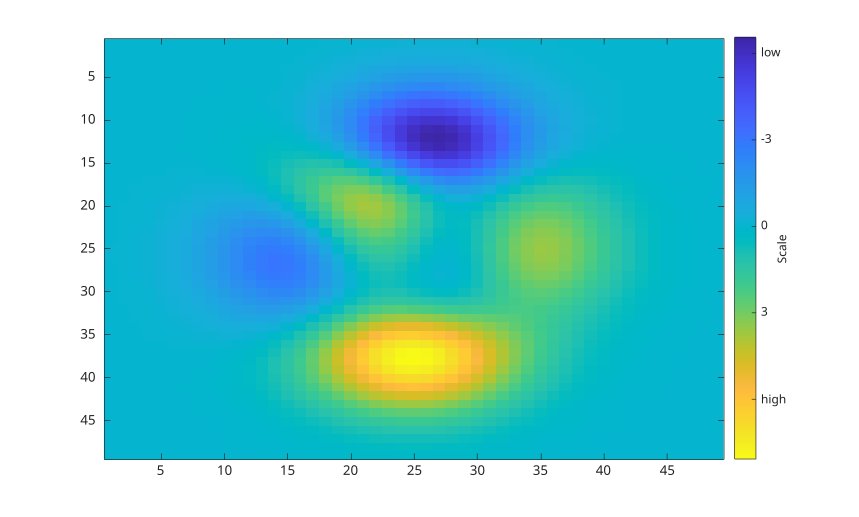
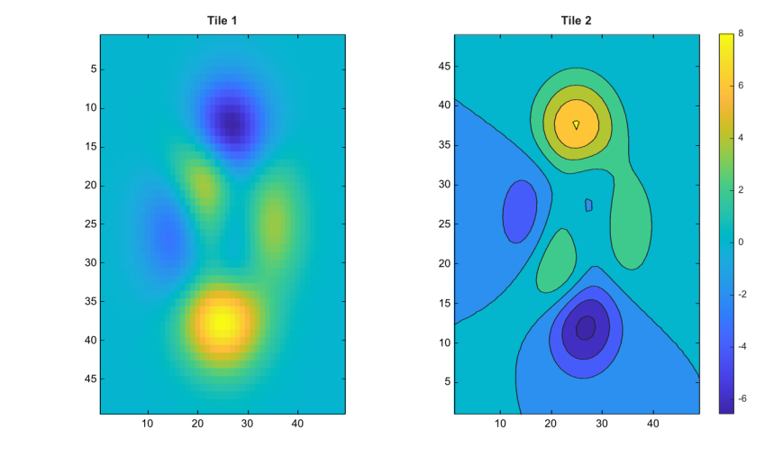

# colorbar

Ajoute une echelle de couleurs aux axes.

## 📝 Syntaxe

- colorbar
- colorbar(location)
- colorbar(target, ...)
- colorbar('peer', target, ...)
- colorbar(..., propertyName, propertyValue)
- colorbar('off')
- colorbar('delete')
- colorbar('hide')
- colorbar(target, 'off')
- colorbar(c, 'off')
- c = colorbar(...)

## 📥 Argument d'entrée

- location - Emplacement de la barre de couleur : 'eastoutside', 'westoutside', 'northoutside', 'southoutside', 'east', 'west', 'north', 'south' ou 'manual'. Les valeurs 'horizontal' et 'vertical' sont acceptees comme alias de compatibilite de 'southoutside' et 'eastoutside'.
- target - Axes auxquels appartient l'echelle de couleurs. Si la cible est omise, les axes courants sont utilises.
- c - Objet graphique colorbar.
- propertyName, propertyValue - Paires nom-valeur appliquees aux proprietes de la barre de couleur lors de sa creation.
- 'off', 'delete', 'hide' - Supprime la barre de couleur associee aux axes courants, aux axes specifies ou a la barre de couleur specifiee.

## 📤 Argument de sortie

- c - Objet graphique colorbar.

## 📄 Description

<b>colorbar</b> ajoute une echelle de couleurs a un graphique. La barre de couleur est un objet graphique rattache a la figure et associe a des axes.

L'emplacement par defaut est <b>eastoutside</b>. Les emplacements externes reservent de la place pres des axes. Les emplacements internes dessinent la barre de couleur dans la zone des axes. Affecter la propriete <b>Position</b> passe <b>Location</b> a <b>manual</b>.

La propriete <b>Location</b> accepte aussi <b>layout</b> pour les dispositions en tuiles. Utilisez <b>colorbar(ax, 'Location', 'layout')</b> puis affectez <b>c.Layout.Tile</b> avec un numero de tuile ou avec 'east', 'west', 'north' ou 'south'. La forme positionnelle <b>colorbar(ax, 'layout')</b> n'est pas acceptee.

Les proprietes visuelles importantes incluent <b>Box</b>, <b>Color</b>, <b>Direction</b>, <b>FontAngle</b>, <b>FontName</b>, <b>FontSize</b>, <b>FontWeight</b>, <b>Limits</b>, <b>LineWidth</b>, <b>AxisLocation</b>, <b>TickDirection</b>, <b>TickLabelInterpreter</b>, <b>TickLabels</b>, <b>TickLength</b>, <b>Ticks</b>, <b>Units</b>, <b>Visible</b> et <b>Label</b>.

Les valeurs automatiques de <b>Limits</b>, <b>Ticks</b> et <b>TickLabels</b> sont mises a jour depuis les limites de couleur et la palette des axes associes. Affecter <b>Limits</b>, <b>Ticks</b>, <b>TickLabels</b>, <b>AxisLocation</b> ou <b>Position</b> passe la propriete de mode correspondante en manuel lorsque c'est approprie.

Voir [proprietes de colorbar](../../../graphics/2_graphics_objects/4_properties/nelson.graphics.colorbar.properties.md) pour la liste complete des proprietes.

## 💡 Exemples

Afficher une barre de couleur verticale pour une surface.

```matlab
figure();
surf(peaks);
colormap('summer');
colorbar;
```


Placer une barre horizontale sous des contours remplis.

```matlab
figure();
contourf(peaks);
colormap('parula');
colorbar('southoutside');
```


Personnaliser les graduations, leurs textes et le libelle de la barre.

```matlab
figure();
imagesc(peaks);
cb = colorbar('Ticks', [-6 -3 0 3 6], ...
  'TickLabels', {'low'; '-3'; '0'; '3'; 'high'});
cb.Label.String = 'Scale';
cb.Direction = 'reverse';
```


Associer une barre de couleur au bord d'une disposition en tuiles.

```matlab
figure();
t = tiledlayout(1, 2);
ax1 = nexttile(t);
imagesc(peaks);
title(ax1, 'Tile 1');
ax2 = nexttile(t);
contourf(peaks);
title(ax2, 'Tile 2');
cb = colorbar(ax2, 'Location', 'layout');
cb.Layout.Tile = 'east';
```


Essayer tous les emplacements standards.

```matlab
locations = {'north'; 'south'; 'east'; 'west'; ...
  'northoutside'; 'southoutside'; 'eastoutside'; 'westoutside'};
figure();
surf(peaks);
colormap('jet');
for k = 1:length(locations)
  colorbar(locations{k});
  pause(1);
end
```

## 🔗 Voir aussi

[proprietes de colorbar](../../../graphics/2_graphics_objects/4_properties/nelson.graphics.colorbar.properties.md), [colormap](../../../graphics/3_labels_styling/2_color_styling/colormaps/colormap.md), [clim](../../../graphics/3_labels_styling/2_color_styling/clim.md), [contourf](../../../graphics/1_plots/3_contour_plots/contourf.md), [tiledlayout](../../../graphics/2_graphics_objects/2_layout_objects/tiledlayout.md).

## 🕔 Historique

| Version | 📄 Description                                        |
| ------- | ----------------------------------------------------- |
| 1.0.0   | version initiale                                      |
| 1.15.0  | ajout du support de l'argument location               |
| 2.0.0   | reimplementation comme objet graphique colorbar natif |

<!--
## 👤 Auteur

Allan CORNET
-->
