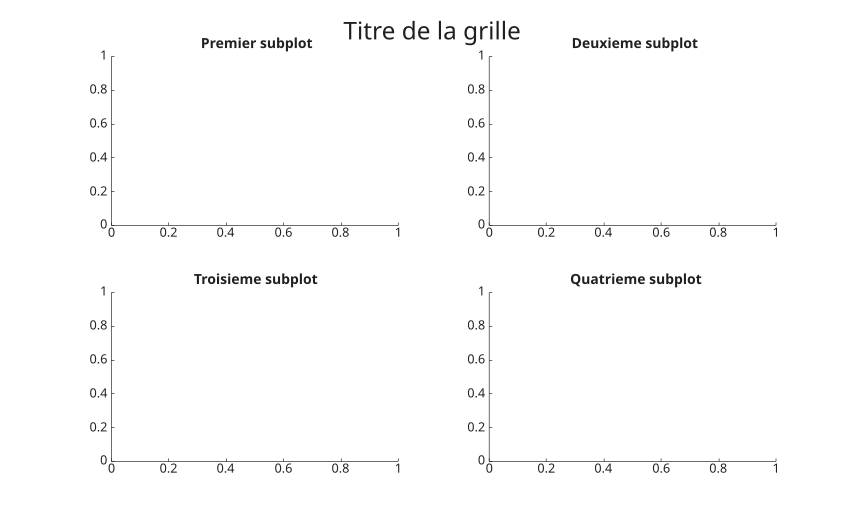
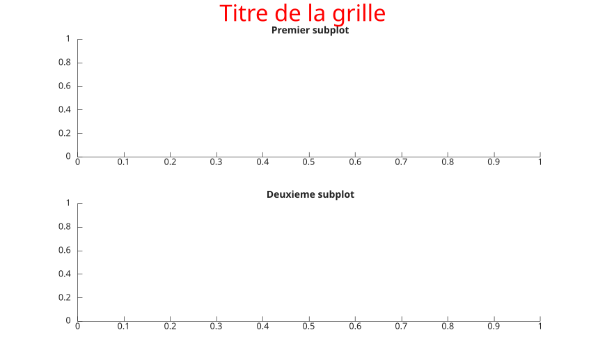

# sgtitle

Ajouter un titre commun a une disposition graphique.

## 📝 Syntaxe

- sgtitle(text)
- sgtitle(target, text)
- sgtitle(..., propertyName, propertyValue)
- go = sgtitle(...)

## 📥 Argument d'entrée

- text - Texte a afficher.
- target - Objet graphique tiled layout ou axes.
- propertyName - Nom de propriete de l'objet texte.
- propertyValue - Valeur de propriete de l'objet texte.

## 📤 Argument de sortie

- go - Objet graphique pour le titre commun.

## 📄 Description


<b>sgtitle</b> ajoute un titre commun au tiled layout courant s'il existe. Sinon, il ajoute un titre commun au-dessus des axes subplot de la figure courante.

## 💡 Exemples

Titre commun pour une grille de subplots.

```matlab
f = figure();
subplot(2, 2, 1)
title('Premier subplot')
subplot(2, 2, 2)
title('Deuxieme subplot')
subplot(2, 2, 3)
title('Troisieme subplot')
subplot(2, 2, 4)
title('Quatrieme subplot')
sgtitle('Titre de la grille')
```

Definir les proprietes du titre commun.

```matlab
f = figure();
subplot(2, 1, 1)
title('Premier subplot')
subplot(2, 1, 2)
title('Deuxieme subplot')
sgt = sgtitle('Titre de la grille', 'Color', 'red');
sgt.FontSize = 20;
```

Titre commun pour un tiled layout.

```matlab
t = tiledlayout(2, 1);
nexttile(t);
plot(1:10);
nexttile(t);
plot((1:10).^2);
sgtitle(t, 'Titre commun');
```


## 🔗 Voir aussi

[title](../../../graphics/3_labels_styling/4_labels_annotations/title.md), [tiledlayout](../../../graphics/2_graphics_objects/2_layout_objects/tiledlayout.md).

## 🕔 Historique

| Version | 📄 Description     |
| ------- | --------------- |
| 2.0.0   | Version initiale |

<!--
## 👤 Auteur

Allan CORNET
-->
