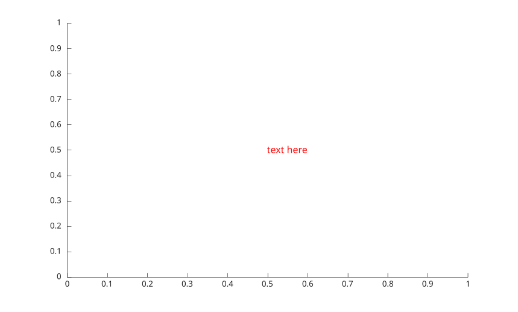
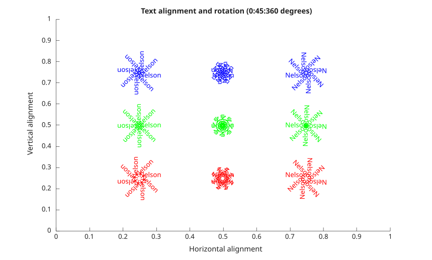

# text

crée des descriptions textuelles pour les points de données.

## 📝 Syntaxe

- text(x, y, txt)
- text(x, y, z, txt)
- text(... , propertyName, propertyValue)
- text(propertyName, propertyValue)
- text(ax, ...)
- go = text(...)

## 📥 Argument d'entrée

- x - coordonnées x : vecteur ou matrice.
- y - coordonnées y : vecteur ou matrice.
- z - coordonnées z : vecteur ou matrice.
- parent - une valeur d'objet graphique scalaire : conteneur parent, spécifié comme axes.
- text - Texte à afficher : vecteur de caractères, scalaire de chaîne, tableau de chaînes ou tableau de cellules.
- propertyName - une chaîne scalaire ou un vecteur de caractères ligne.
- propertyValue - une valeur.

## 📤 Argument de sortie

- go - un objet graphique : type texte.

## 📄 Description


<b>text</b> crée du texte. 

Voir [proprietes de text](../../../graphics/2_graphics_objects/4_properties/nelson.graphics.text.properties.md) pour la liste complete des proprietes. 

La propriété <b>Interpreter</b> choisit comment la chaîne <b>String</b> est analysée : <b>'tex'</b> (par défaut) affiche un sous-ensemble du balisage TeX (les caractères spéciaux ci-dessous, ainsi que les exposants <b>^{ }</b> et les indices <b>\_{ }</b>) ; <b>'none'</b> affiche le texte tel quel. 

La valeur <b>'latex'</b> est acceptée, mais un moteur de mise en page LaTeX complet (<b>\\frac</b>, <b>\\sqrt</b>, <b>\\int</b> avec bornes, matrices, etc.) n'est pas encore implémenté. Elle se rabat sur le pipeline <b>'tex'</b> après suppression d'une paire de délimiteurs mathématiques <b>$...$</b> entourants, de sorte que les symboles connus et les exposants/indices sont rendus tandis que les constructions non prises en charge apparaissent sous forme de texte source. Un interpréteur LaTeX complet est prévu pour une version future. 

listes des caractères spéciaux pris en charge par l'interpréteur 'tex' : 

Exposant : ^{ } 'texte^{exposant}' 

Indice : \_{ } 'texte\_{indice}' 

 
| Séquence de caractères | Symbole | 
| --- | --- | 
| \\alpha | α | 
| \\upsilon | υ | 
| \\sim | ~ | 
| \\angle | ∠ | 
| \\phi | ϕ | 
| \\leq | ≤ | 
| \\ast | \* | 
| \\chi | χ | 
| \\infty | ∞ | 
| \\beta | β | 
| \\psi | ψ | 
| \\clubsuit | ♣ | 
| \\gamma | γ | 
| \\omega | ω | 
| \\diamondsuit | ♦ | 
| \\delta | δ | 
| \\Gamma | Γ | 
| \\heartsuit | ♥ | 
| \\epsilon | ϵ | 
| \\Delta | Δ | 
| \\spadesuit | ♠ | 
| \\zeta | ζ | 
| \\Theta | Θ | 
| \\leftrightarrow | ↔ | 
| \\eta | η | 
| \\Lambda | Λ | 
| \\leftarrow | ← | 
| \\theta | θ | 
| \\Xi | Ξ | 
| \\Leftarrow | ⇐ | 
| \\vartheta | ϑ | 
| \\Pi | Π | 
| \\uparrow | ↑ | 
| \\iota | ι | 
| \\Sigma | Σ | 
| \\rightarrow | -> | 
| \\kappa | κ | 
| \\Upsilon | ϒ | 
| \\Rightarrow | ⇒ | 
| \\lambda | λ | 
| \\Phi | Φ | 
| \\downarrow | ↓ | 
| \\mu | µ | 
| \\Psi | Ψ | 
| \\circ | º | 
| \\nu | ν | 
| \\Omega | Ω | 
| \\pm | ± | 
| \\xi | ξ | 
| \\forall | ∀ | 
| \\geq | ≥ | 
| \\pi | π | 
| \\exists | ∃ | 
| \\propto | ∝ | 
| \\rho | ρ | 
| \\ni | ∍ | 
| \\partial | ∂ | 
| \\sigma | σ | 
| \\cong | ≅ | 
| \\bullet | • | 
| \\varsigma | ς | 
| \\approx | ≈ | 
| \\div | ÷ | 
| \\tau | τ | 
| \\Re | ℜ | 
| \\neq | ≠ | 
| \\equiv | ≡ | 
| \\oplus | ⊕ | 
| \\aleph | ℵ | 
| \\Im | ℑ | 
| \\cup | ∪ | 
| \\wp | ℘ | 
| \\otimes | ⊗ | 
| \\subseteq | ⊆ | 
| \\oslash | ∅ | 
| \\cap | ∩ | 
| \\in | ∈ | 
| \\supseteq | ⊇ | 
| \\supset | ⊃ | 
| \\lceil | ⌈ | 
| \\subset | ⊂ | 
| \\int | ∫ | 
| \\cdot | · | 
| \\o | ο | 
| \\rfloor | ⌋ | 
| \\neg | ¬ | 
| \\nabla | ∇ | 
| \\lfloor | ⌊ | 
| \\times | x | 
| \\ldots | ... | 
| \\perp | ⊥ | 
| \\surd | √ | 
| \\prime | ´ | 
| \\wedge | ∧ | 
| \\varpi | ϖ | 
| \\0 | ∅ | 
| \\rceil | ⌉ | 
| \\rangle | 〉 | 
| \\mid | \| | 
| \\vee | ∨ | 
| \\langle | 〈 | 
| \\copyright | © | 


## 💡 Exemples


```matlab
f = figure(1)
t = text(0.5, 0.5, 'text here');
s = t.FontSize;
t.FontSize = 12;
t.Color = 'red';

```



```matlab
figure();
ha = {'left', 'center', 'right'};
va = {'bottom', 'middle', 'top'};
color = {'red', 'green', 'blue'};
x = [0.25 0.5 0.75];
y = x;
for t = 0:45:359;
  for nh = 1:numel (ha)
    for nv = 1:numel (va)
      text (x(nh), y(nv), 'Nelson', ...
      'Rotation', t, ...
      'HorizontalAlignment', ha{nh}, ...
      'VerticalAlignment', va{nv}, ...
      'Color', color{nv});
    end
  end
end
axis([0 1 0 1]);
title ('Text alignment and rotation (0:45:360 degrees)');
xlabel('Horizontal alignment');
ylabel ('Vertical alignment');
```



```matlab
figure();
h1 = text(0.5, 0.5, 'Nelson \copyright')
h1.String
% Nelson est entièrement unicode, donc
h2 = text(0.5, 0.3, 'OU Nelson ©')
h2.String
```


## 🔗 Voir aussi

[proprietes de text](../../../graphics/2_graphics_objects/4_properties/nelson.graphics.text.properties.md), [titre](../../../graphics/3_labels_styling/4_labels_annotations/title.md).

## 🕔 Historique

| Version | 📄 Description     |
| ------- | --------------- |
| 1.0.0   | version initiale |
| 1.7.0   | Callbacks CreateFcn, DeleteFcn ajoutés. |
| --   | Propriété BeingDeleted ajoutée. |

<!--
## 👤 Auteur

Allan CORNET
-->
