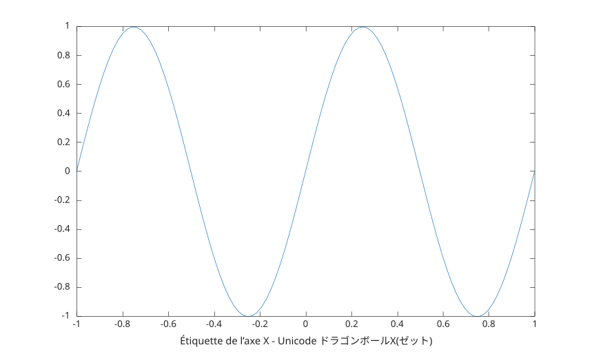

# xlabel

Étiquette de l'axe des x.

## 📝 Syntaxe

- xlabel(text)
- xlabel(ax, text)
- xlabel(..., propertyName, propertyValue)
- go = xlabel(...)

## 📥 Argument d'entrée

- text - Texte à afficher : vecteur de caractères, scalaire de chaîne, tableau de chaînes ou tableau de cellules.
- ax - une valeur scalaire d'objet graphique : conteneur parent, spécifié comme un axes.
- propertyName - une chaîne scalaire ou un vecteur de caractères en ligne.
- propertyValue - une valeur.

## 📤 Argument de sortie

- go - un objet graphique : type texte.

## 📄 Description

<b>xlabel('text')</b> étiquette l'axe des x des axes actuels.

## 💡 Exemple

```matlab
f = figure();
x = linspace(-1, 1);
y = sin(2*pi*x);
plot(x, y);
xlabel('Étiquette de l’axe X - Unicode ドラゴンボールX(ゼット)')
```



## 🔗 Voir aussi

[text](../../../graphics/3_labels_styling/4_labels_annotations/text.md), [title](../../../graphics/3_labels_styling/4_labels_annotations/title.md).

## 🕔 Historique

| Version | 📄 Description   |
| ------- | ---------------- |
| 1.0.0   | version initiale |

<!--
## 👤 Auteur

Allan CORNET
-->
