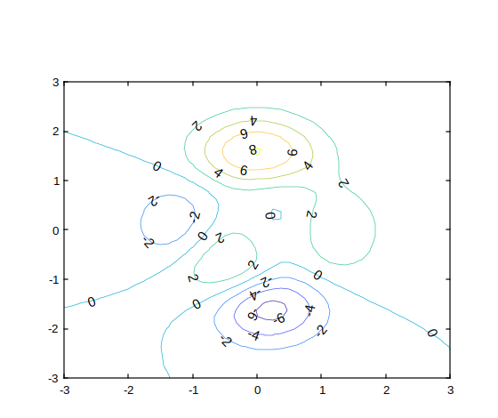
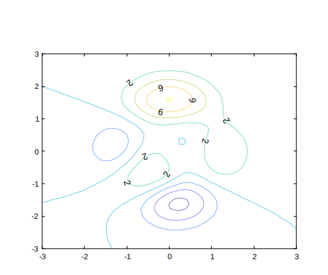
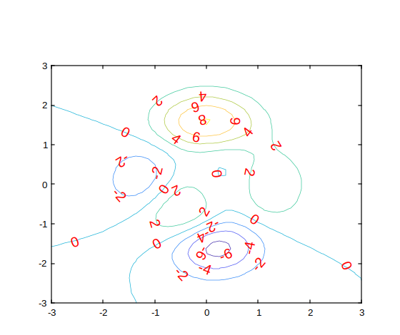
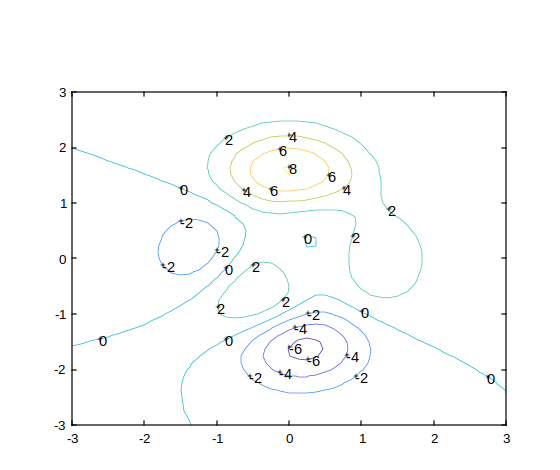

# clabel

Étiquetage des contours

## 📝 Syntaxe

- clabel(C,h)
- clabel(C,h,v)
- clabel(C)
- clabel(C,v)
- tl = clabel(...)
- clabel(...,Name,Value)

## 📥 Argument d'entrée

- C -

Matrice Contour retournée par <b>contour</b>, <b>contourf</b>, ou<b>contour3</b>. Si vous passez un objet contour<b>h</b>, vous pouvez passer <b>[]</b> pour <b>C</b>.

- h -

Handle d'objet contour retourné par <b>contour</b> / <b>contourf</b> / <b>contour3</b>. Lorsqu'il est fourni, l'étiquetage utilise les informations attachées à l'objet contour (niveaux et matrice de contour).

- v -

Vecteur des niveaux de contour à étiqueter. Lorsqu'il est fourni, seuls ces niveaux reçoivent des étiquettes.

## 📤 Argument de sortie

- t -

Objets Text créés par <b>clabel</b>. Les propriétés <b>String</b> contiennent les valeurs de contour affichées.

- tl -

Objets Text et ligne créés lorsque des marqueurs droits sont utilisés (pour l'utilisation de style <b>clabel(C)</b>).

## 📄 Description

La fonction<b>clabel</b> insère des étiquettes dans les graphiques de contours :

- Fournir une matrice de contour <b>C</b> et un objet de contour<b>h</b> pour étiqueter le texte tourné le long des lignes de contour.
- Fournir uniquement<b>C</b> pour ajouter des étiquettes droites et des marqueurs '+' aux emplacements de contour.
- Passer un vecteur de niveaux<b>v</b> pour étiqueter uniquement des valeurs de contour spécifiques.
- Utiliser des paires Name,Value pour contrôler l'apparence du texte (un sous-ensemble des propriétés Text, plus <b>LabelSpacing</b>).

## 💡 Exemples

Étiqueter les niveaux de contour (de base).

```matlab
figure();
[x,y,z] = peaks;
[C,h] = contour(x,y,z);
clabel(C,h)
```


Étiqueter des niveaux de contour spécifiques.

```matlab
figure();
[x,y,z] = peaks;
[C,h] = contour(x,y,z);
v = [2,6];
clabel(C,h,v)
```


Définir les propriétés des étiquettes de contour avec des paires Name,Value.

```matlab
figure();
[x,y,z] = peaks;
[C,h] = contour(x,y,z);
clabel(C,h,'FontSize',15,'Color','red')
```


Étiqueter en utilisant uniquement la matrice de contour (étiquettes droites).

```matlab
figure();
[x,y,z] = peaks;
C = contour(x,y,z);
clabel(C)
```



## 🔗 Voir aussi

[contour](../graphics/contour.md), [contourf](../graphics/contourf.md), [contourc](../graphics/contourf.md).

## 🕔 Historique

| Version | 📄 Description   |
| ------- | ---------------- |
| 1.15.0  | version initiale |

<!--
## 👤 Auteur

Allan CORNET
-->
