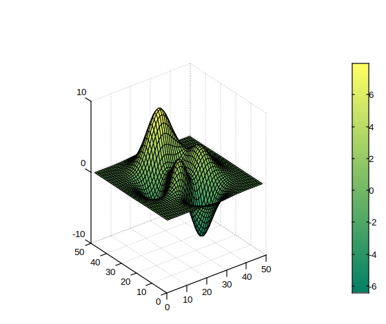
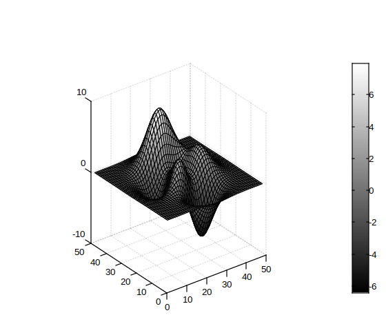

# colorbar

Barre de couleur affichant l'échelle des couleurs.

## 📝 Syntaxe

- colorbar()
- colorbar('off')
- colorbar(location)
- colorbar(..., propertyName, propertyValue)
- colorbar(target, ...)
- colorbar(target, 'off')
- c = colorbar(...)

## 📥 Argument d'entrée

- propertyName - une chaîne scalaire ou un vecteur ligne de caractères.
- propertyValue - une valeur.
- target - Cible : axes.
- 'off' - supprime la barre de couleur associée aux axes courants.
- location - spécifie la position de la barre de couleur: 'north','south','east','west', ...

## 📤 Argument de sortie

- c - objet graphique : axes de la barre de couleur.

## 📄 Description

<b>colorbar</b> ajoute une barre de couleur à un graphique.

Elle peut être placée à différents emplacements autour des axes.

Les emplacements pris en charge incluent : 'north','south','east','west', 'northoutside','southoutside','eastoutside','westoutside'.

## 💡 Exemples

```matlab
f = figure();
surf(peaks);
axis('square');
colormap('summer');
colorbar()

```



```matlab
f = figure();
surf(peaks);
axis('square');
colormap('gray');
cb = colorbar(gca);
```



```matlab
locations = { 'north';
'south';
'east';
'west';
'northoutside';
'southoutside';
'eastoutside';
'westoutside'};
f = figure();
surf(peaks);
colormap('jet');
for k = 1 : length(locations)
    colorbar(locations{k});
    pause(1);
end

```

## 🔗 Voir aussi

[colormap](../graphics/colormap/colormap.md).

## 🕔 Historique

| Version | 📄 Description                         |
| ------- | -------------------------------------- |
| 1.0.0   | version initiale                       |
| 1.15.0  | ajout du support du paramètre location |

<!--
## 👤 Auteur

Allan CORNET
-->
