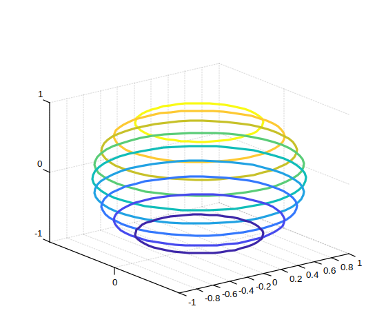

# contour3

Tracé de contours 3D d'une matrice

## 📝 Syntaxe

- contour3(Z)
- contour3(X, Y, Z)
- contour3(..., levels)
- contour3(..., LineSpec)
- contour3(ax, ...)
- M = contour3(...)
- [M, h] = contour3(...)

## 📥 Argument d'entrée

- X - Coordonnées x : vecteur ou matrice.
- Y - Coordonnées y : vecteur ou matrice.
- Z - Coordonnées z : vecteur ou matrice.
- levels - Niveaux de contours : scalaire ou vecteur.
- LineSpec - Style et couleur de ligne
- ax - Un objet graphique scalaire : conteneur parent, spécifié comme axes.

## 📤 Argument de sortie

- M - Matrice de contours.
- h - Un objet graphique : type contour.

## 📄 Description

<b>contour3(Z)</b> génère un tracé de contours 3D illustrant les isolignes de la matrice Z, où Z représente les hauteurs sur le plan x-y.

Les coordonnées x et y dans le plan correspondent respectivement aux indices de colonnes et de lignes de Z.

Pour spécifier les coordonnées x et y pour les valeurs de Z, utilisez <b>contour3(X,Y,Z)</b>.

## 💡 Exemple

```matlab
f = figure();
[X,Y,Z] = sphere(50);
[M, C ]= contour3(X,Y,Z);
C.LineWidth = 3;
```



## 🔗 Voir aussi

[contour](../graphics/contour.md), [contourc](../graphics/contourc.md), [contourf](../graphics/contourf.md), [clabel](../graphics/clabel.md), [surf](../graphics/surf.md), [mesh](../graphics/mesh.md).

## 🕔 Historique

| Version | 📄 Description   |
| ------- | ---------------- |
| 1.3.0   | version initiale |

<!--
## 👤 Auteur

Allan CORNET
-->
