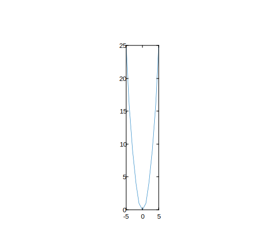
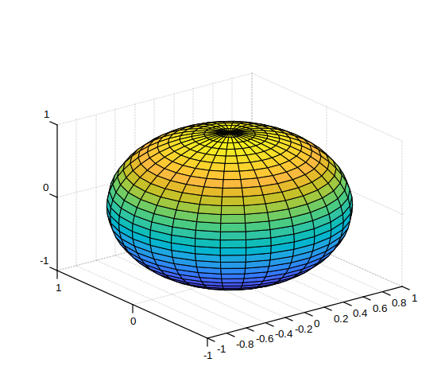

# daspect

Contrôler la longueur des unités de données le long de chaque axe.

## 📝 Syntaxe

- daspect(ratio)
- d = daspect()
- daspect('auto')
- daspect('manual')
- m = daspect('mode')
- daspect(ax, ...)

## 📥 Argument d'entrée

- ratio - Vecteur à trois éléments de valeurs positives spécifiant les longueurs relatives des unités de données le long des axes x, y et z.
- 'auto' - Définir le mode du rapport d'aspect des données sur automatique.
- 'manual' - Définir le mode du rapport d'aspect des données sur manuel.
- 'mode' - Interroger le mode actuel du rapport d'aspect des données ('auto' ou 'manual').
- ax - Objet des axes cibles. Si non spécifié, utilise les axes actuels.

## 📤 Argument de sortie

- d - Three-element vector representing the current data aspect ratio.
- m - Mode actuel du rapport d'aspect des données : 'auto' ou 'manual'.

## 📄 Description

<b>daspect</b> contrôle les longueurs relatives des unités de données le long des axes x, y et z.

<b>daspect(ratio)</b> définit le rapport d'aspect des données pour les axes actuels. <b>ratio</b> est un vecteur à trois éléments de valeurs positives. Par exemple, [1 2 3] signifie que la longueur de 0 à 1 le long de l'axe x est égale à la longueur de 0 à 2 le long de l'axe y et de 0 à 3 le long de l'axe z.

<b>d = daspect()</b> renvoie le rapport d'aspect des données actuel sous forme de vecteur à trois éléments.

<b>daspect('auto')</b> définit le mode du rapport d'aspect des données sur automatique, permettant aux axes de choisir le rapport.

<b>daspect('manual')</b> définit le mode sur manuel et utilise le rapport stocké dans les axes.

<b>m = daspect('mode')</b> renvoie le mode actuel, soit 'auto' soit 'manual'.

<b>daspect(ax, ...)</b> agit sur les axes spécifiés par <b>ax</b> au lieu des axes actuels.

Définir le rapport d'aspect des données désactive le comportement d'étirement pour remplir les axes.

## 💡 Exemples

Étirez X par rapport à Y

```matlab

plot(-5:5, (-5:5).^2)
daspect([2 1 1])
```


Définir des longueurs d'unités de données différentes pour chaque axe

```matlab

sphere(40);
daspect([2 1 0.5])

```


Basculer entre les modes de rapport d'aspect manuel et automatique

```matlab

[X, Y, Z] = sphere(30);
surf(X, Y, Z)
daspect([2 1 1])
disp(daspect('mode'))
daspect('auto')
disp(daspect('mode'))

```


Interroger le rapport d'aspect des données actuel

```matlab

[x, y] = meshgrid(-2:0.2:2);
z = x .* exp(-x.^2 - y.^2);
surf(x, y, z)
d = daspect()
disp(d)

```


## 🔗 Voir aussi

[pbaspect](../graphics/pbaspect.md), [axis](../graphics/axis.md), [xlim](../graphics/xlim.md), [ylim](../graphics/ylim.md), [zlim](../graphics/zlim.md).

## 🕔 Historique

| Version | 📄 Description   |
| ------- | ---------------- |
| 1.16.0  | version initiale |

<!--
## 👤 Auteur

Allan CORNET
-->
