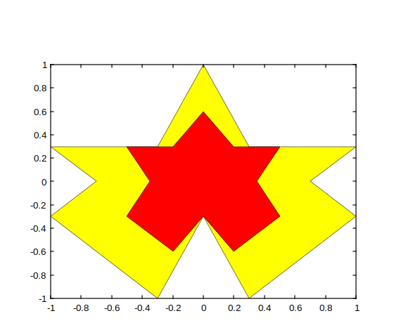
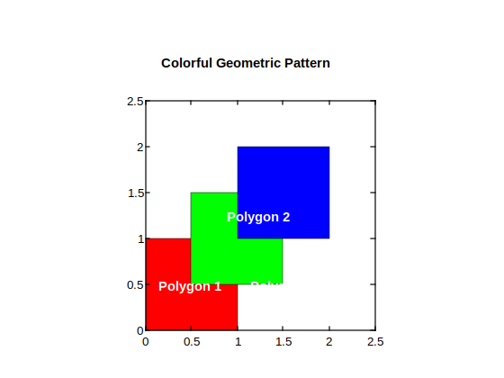
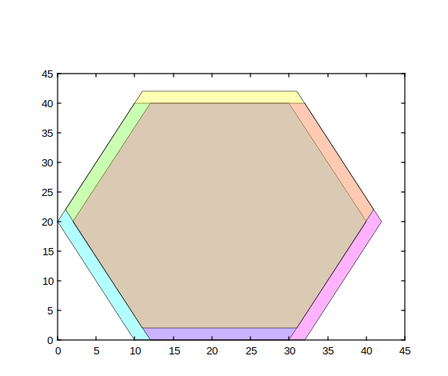

# fill

Créer des formes 2D remplies.

## 📝 Syntaxe

- fill(X, Y, C)
- fill(..., propertyName, propertyValue)
- fill(ax, ...)
- go = fill(...)

## 📥 Argument d'entrée

- X - Coordonnées x : vecteur ou matrice.
- Y - Coordonnées y : vecteur ou matrice.
- C - Tableau de couleurs : scalaire, vecteur, matrice m×n×3 de triplets RGB.
- ax - Un objet graphique scalaire : conteneur parent, spécifié comme axes.
- propertyName - Une chaîne scalaire ou un vecteur ligne de caractères.
- propertyValue - Une valeur.

## 📤 Argument de sortie

- go - Un objet graphique : type patch.

## 📄 Description

<b>fill(X, Y, C)</b> crée une forme polygonale 2D avec des sommets définis par les coordonnées<b>X</b> et <b>Y</b>, et remplit la forme avec la couleur <b>C</b>.

<b>fill(..., PropertyName, PropertyValue, ...)</b> définit des propriétés optionnelles pour l'objet fill/patch à l'aide de paires nom-valeur.

<b>go = fill(...)</b> retourne le handle <b>go</b> de l'objet patch créé.

Paires Nom-Valeur de propriétés :

<b>'FaceColor'</b> : couleur de la forme remplie. FaceColor peut être une chaîne de caractères ou un vecteur RGB à 3 éléments. Par défaut : <b>'flat'</b>.

<b>'EdgeColor'</b> : couleur des bords de la forme polygonale. EdgeColor peut être une chaîne de caractères ou un vecteur RGB à 3 éléments. Par défaut : <b>'none'</b>.

<b>'LineWidth'</b> : épaisseur des bords de la forme polygonale. Par défaut : <b>0.5</b>.

<b>'LineStyle'</b> : style des bords de la forme polygonale. LineStyle peut être une chaîne de caractères ou un code de style de ligne. Par défaut : <b>'-'</b>.

<b>'FaceAlpha'</b> : transparence de la forme remplie. FaceAlpha peut être un scalaire entre 0 et 1. Par défaut : <b>1</b>.

<b>'EdgeAlpha'</b> : transparence des bords de la forme polygonale. EdgeAlpha peut être un scalaire entre 0 et 1. Par défaut : <b>1</b>.

<b>'Parent'</b> : handle de l'objet parent pour le patch. Par défaut :<b>gca()</b>.

<b>'Vertices'</b> : matrice des coordonnées des sommets. La matrice doit avoir la taille N×2 ou N×3, où N est le nombre de sommets. Par défaut : les coordonnées des sommets sont spécifiées par les arguments<b>X</b>, <b>Y</b> et <b>Z</b> d'entrée.

## 💡 Exemples

```matlab
f = figure();
outerX = [0, 0.3, 1, 0.7, 1, 0.3, 0, -0.3, -1, -0.7, -1, -0.3, 0];
outerY = [1, 0.3, 0.3, 0, -0.3, -1, -0.3, -1, -0.3, 0, 0.3, 0.3, 1];
innerX = [0, 0.2, 0.5, 0.35, 0.5, 0.2, 0, -0.2, -0.5, -0.35, -0.5, -0.2, 0];
innerY = [0.6, 0.3, 0.3, 0, -0.3, -0.6, -0.3, -0.6, -0.3, 0, 0.3, 0.3, 0.6];
fill(outerX, outerY, 'y');
fill(innerX, innerY, 'r');
```



```matlab
% Define the vertices of a colorful geometric pattern
x1 = [0, 1, 1, 0];
y1 = [0, 0, 1, 1];
x2 = [0.5, 1.5, 1.5, 0.5];
y2 = [0.5, 0.5, 1.5, 1.5];
x3 = [1, 2, 2, 1];
y3 = [1, 1, 2, 2];

% Define colors for the polygons
colors = ['r', 'g', 'b'];

% Create a figure with a white background
figure('Color', 'w');

% Fill the polygons with different colors
fill(x1, y1, colors(1));
hold on;
fill(x2, y2, colors(2));
fill(x3, y3, colors(3));

% Add labels to distinguish the regions
text(0.5, 0.5, 'Polygon 1', 'Color', 'w', 'HorizontalAlignment', 'center', 'FontWeight', 'bold');
text(1.25, 1.25, 'Polygon 2', 'Color', 'w', 'HorizontalAlignment', 'center', 'FontWeight', 'bold');
text(1.5, 0.5, 'Polygon 3', 'Color', 'w', 'HorizontalAlignment', 'center', 'FontWeight', 'bold');

axis equal;
title('Colorful Geometric Pattern');

```


Canal alpha

```matlab
f = figure();
x = [10 30 40 30 10 0];
y = [0 0 20 40 40 20];
hold on
fill(x, y, 'cyan', 'FaceAlpha', 0.3);
fill(x + 2, y, 'magenta', 'FaceAlpha', 0.3);
fill(x + 1, y + 2, 'yellow', 'FaceAlpha', 0.3);
```



## 🔗 Voir aussi

[patch](../graphics/patch.md).

## 🕔 Historique

| Version | 📄 Description   |
| ------- | ---------------- |
| 1.0.0   | version initiale |

<!--
## 👤 Auteur

Allan CORNET
-->
