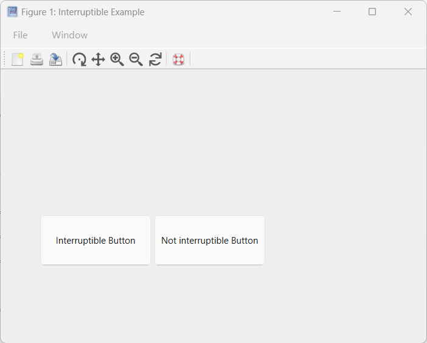

# Gestion des interruptions de callback dans Nelson

## 📄 Description

Vous pouvez affecter une fonction de rappel (callback) à une propriété de callback en utilisant l'une des méthodes suivantes :

<b>Handle de fonction</b> : Utilisez cette approche lorsque votre callback n'a pas besoin d'arguments supplémentaires.

<b>Cellule</b> : Idéal lorsque votre callback nécessite des arguments supplémentaires. La cellule doit inclure le handle de fonction comme premier élément, suivi des arguments d'entrée.

<b>Fonction anonyme</b> : Cette méthode convient pour un code de callback simple ou si vous souhaitez réutiliser une fonction qui n'est pas exclusivement utilisée comme callback.

<b>Vecteur de caractères ou chaîne scalaire</b> contenant des commandes.

Nelson permet de contrôler si une fonction de callback peut être interrompue pendant son exécution. Dans certains cas, autoriser les interruptions peut être souhaitable, par exemple pour permettre à l'utilisateur d'arrêter une boucle d'animation via un callback interrompant. Cependant, dans des scénarios où l'ordre d'exécution des callbacks est crucial, il peut être nécessaire d'empêcher les interruptions pour garantir le comportement attendu, comme assurer la réactivité dans des applications qui réagissent aux mouvements du pointeur.

Comportement d'interruption des callbacks :

Les callbacks sont exécutés dans l'ordre où ils sont mis en file d'attente. Lorsqu'un callback est en cours d'exécution et qu'une autre action utilisateur déclenche un second callback, ce second callback tente d'interrompre le premier. Le premier est appelé « callback en cours d'exécution », le second « callback interrompant ».

Dans certains cas, des commandes spécifiques dans le callback en cours invitent Nelson à traiter les callbacks en attente dans la file.

Lorsque Nelson rencontre l'une de ces commandes comme <b>drawnow</b>, <b>figure</b>, <b>waitfor</b> ou<b>pause</b>, il évalue si une interruption doit avoir lieu.

Pas d'interruption : Si le callback en cours n'inclut aucune de ces commandes, Nelson termine ce callback avant d'exécuter le callback interrompant.

Conditions d'interruption : Si le callback en cours inclut l'une de ces commandes, le comportement dépend de la propriété Interruptible de l'objet propriétaire du callback :

Si <b>Interruptible</b> est à<b>
'on'
</b>, Nelson autorise l'interruption. Le callback en cours est mis en pause, le callback interrompant est exécuté, puis Nelson reprend l'exécution du callback initial.

Si <b>Interruptible</b> est à<b>
'off'
</b>, l'interruption est bloquée. La propriété <b>BusyAction</b> du callback interrompant détermine alors la suite :

Si <b>BusyAction</b> est <b>
'queue'
</b>, le callback interrompant sera exécuté après la fin du callback en cours.

Si <b>BusyAction</b> est <b>
'cancel'
</b>, le callback interrompant est ignoré et non exécuté.

Par défaut, la propriété <b>Interruptible</b> est à <b>
'on'
</b> et <b>BusyAction</b> à <b>
'queue'
</b>.

À noter : certains callbacks, notamment <b>DeleteFcn</b>, <b>CloseRequestFcn</b> et <b>SizeChangedFcn</b>, interrompent le callback en cours quel que soit la valeur de la propriété Interruptible.

## 💡 Exemple

Démo uicontrol Interruptible

```matlab

addpath([modulepath('graphics','root'), '/examples/uicontrol'])
edit uicontrol_demo_interruptible
uicontrol_demo_interruptible

```



## 🔗 Voir aussi

[uicontrol](../graphics/uicontrol.md), [drawnow](../graphics/drawnow.md), [waitfor](../graphics/waitfor.md).

## 🕔 Historique

| Version | 📄 Description   |
| ------- | ---------------- |
| 1.0.0   | version initiale |

<!--
## 👤 Auteur

Allan CORNET
-->
