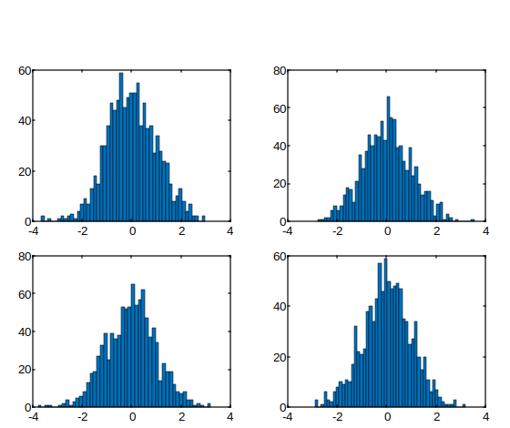

# hist

Tracé d'histogramme.

## 📝 Syntaxe

- hist(x)
- hist(x, nbins)
- hist(ax, ...)
- counts = hist(...)
- [counts, centers] = hist(...)

## 📥 Argument d'entrée

- x - vecteur ou matrice
- nbins - vecteur.
- ax - Objet axes.

## 📤 Argument de sortie

- counts - Nombre d'éléments dans chaque intervalle : vecteur ligne.
- centers - Centres des intervalles : vecteur.

## 📄 Description

Un histogramme est une représentation graphique qui illustre la distribution des valeurs d'un ensemble de données.

Lorsque vous utilisez la fonction <b>hist</b>, elle organise les éléments du vecteur <b>Y</b> en 10 intervalles également espacés et fournit le nombre d'éléments dans chaque intervalle sous forme de vecteur ligne.

<b>hist(Y, x)</b> avec un vecteur<b>x</b>, la fonction retourne la distribution des valeurs de <b>Y</b> parmi des intervalles déterminés par la longueur de <b>x</b>, avec des centres spécifiés par les valeurs de <b>x</b>.

Par exemple, si <b>x</b> est un vecteur de 5 éléments,<b>hist</b> classera les éléments de <b>Y</b> dans cinq intervalles, chacun centré sur l'axe des x aux valeurs spécifiées dans <b>x</b>.

Lorsque vous utilisez <b>hist(...)</b> sans spécifier d'argument de sortie, cela génère un tracé d'histogramme. Les intervalles sont répartis le long de l'axe des x entre les valeurs minimale et maximale trouvées dans le vecteur d'entrée <b>Y</b>.

## 💡 Exemple

```matlab
f = figure();
for i = 1:4
  subplot(2, 2, i)
  hist(randn(1000, 1), 50)
end

```



## 🔗 Voir aussi

[bar](../graphics/bar.md), [patch](../graphics/patch.md).

## 🕔 Historique

| Version | 📄 Description   |
| ------- | ---------------- |
| 1.0.0   | version initiale |

<!--
## 👤 Auteur

Allan CORNET
-->
