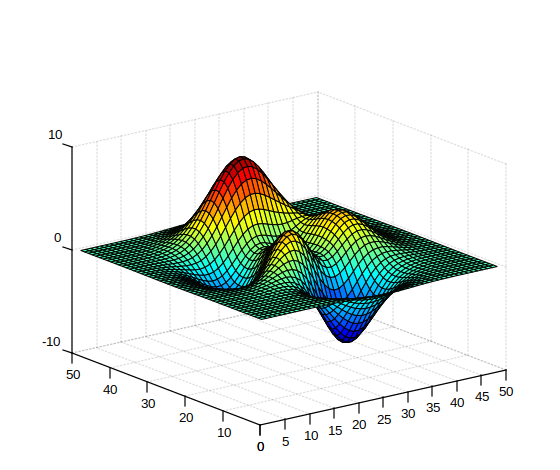

# jet

Tableau de palette de couleurs jet.

## 📝 Syntaxe

- c = jet
- c = jet(m)

## 📥 Argument d'entrée

- m - Un entier scalaire : nombre de couleurs (256 par défaut).

## 📤 Argument de sortie

- c - Tableau de palette de couleurs jet.

## 📄 Description

<b>jet</b> retourne la palette de couleurs jet.

## 💡 Exemple

```matlab
f = figure();
surf(peaks);
colormap('jet');
```



## 🔗 Voir aussi

[colormap](../graphics/colormap/colormap.md).

## 🕔 Historique

| Version | 📄 Description   |
| ------- | ---------------- |
| 1.0.0   | version initiale |

<!--
## 👤 Auteur

Allan CORNET
-->
