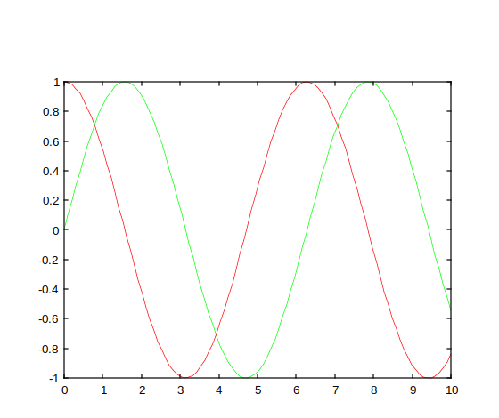
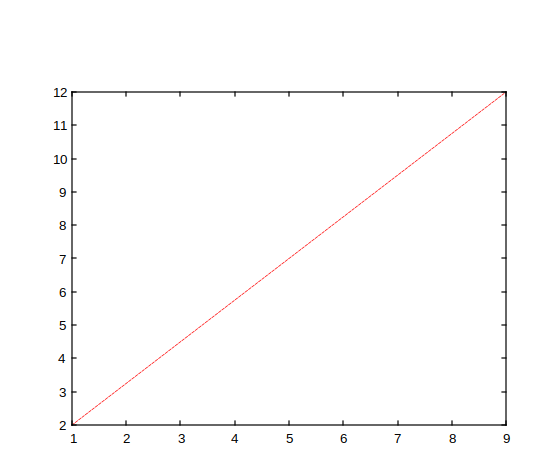
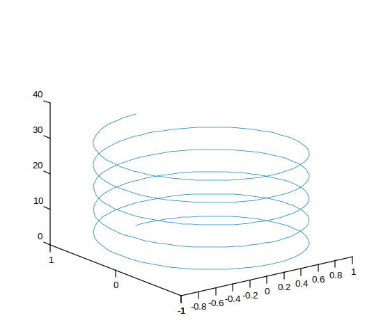

# line

Crée une ligne primitive.

## 📝 Syntaxe

- go = line()
- po = line(x, y)
- go = line(x, y, z)
- go = line(ax, x, y, z)
- go = line(ax, x, y, z, propertyName, propertyValue)

## 📥 Argument d'entrée

- x, y , z - Un ou plusieurs vecteurs ou matrices de coordonnées.
- ax - Axes cibles : objet axes.
- propertyName - Une chaîne scalaire ou un vecteur ligne de caractères.
- propertyValue - Une valeur.

## 📤 Argument de sortie

- go - Un objet graphique : type ligne.

## 📄 Description

<b>line(x, y)</b> crée une ligne dans les axes courants avec les vecteurs<b>x</b> et <b>y</b>.

<b>line(x, y, z)</b> crée une ligne en coordonnées tridimensionnelles.

Propriétés :

<b>Children</b> [] (actuellement non utilisé).

<b>Color</b> Couleur de la ligne : triplet RGB, [0, 0, 0] ou code couleur hexadécimal.

<b>DisplayName</b> Étiquette de légende : vecteur de caractères ou chaîne scalaire, ' ' (par défaut).

<b>LineStyle</b> Style de ligne : '--', ':', '-.', 'none' ou '-' (par défaut).

<b>LineWidth</b> Largeur de ligne : valeur scalaire positive.

<b>Marker</b> Symbole de marqueur : 'o' (cercle), '+' (plus), '\*' (astérisque), '.' (point), 'x' (croix), '\_' (ligne horizontale), '\|' (ligne verticale), 'square', 'diamond', '^' (triangle vers le haut), 'v' (triangle vers le bas), ' > ' (triangle vers la droite), ' < ' (triangle vers la gauche), 'pentagram', 'hexagram', 'none' (par défaut).

<b>MarkerEdgeColor</b> Couleur du contour du marqueur : triplet RGB.

<b>MarkerFaceColor</b> Couleur de remplissage du marqueur : triplet RGB.

<b>MarkerSize</b> Taille du marqueur : valeur scalaire positive.

<b>Parent</b> Parent : objet axes graphique.

<b>Tag</b> Identifiant de l'objet : chaîne scalaire, vecteur de caractères, ' ' (par défaut).

<b>Type</b> Type d'objet graphique : 'line'

<b>UserData</b> Données utilisateur : tableau, [] (par défaut).

<b>Visible</b> État de visibilité : 'off' ou 'on' (par défaut).

<b>XData</b> valeurs x : vecteur, [0 1] (par défaut).

<b>YData</b> valeurs y : vecteur, [0 1] (par défaut).

<b>ZData</b> valeurs z : vecteur, [] (par défaut).

<b>CreateFcn</b> Callback (fonction, chaîne ou cellule) appelée lors de la création de l'objet. Définir cette propriété sur un composant existant n'a aucun effet.

<b>DeleteFcn</b> Callback (fonction, chaîne ou cellule) appelée lors de la suppression de l'objet.

<b>BeingDeleted</b> Indique que l'objet est en cours de suppression.

## 💡 Exemples

```matlab
f = figure();
x = linspace(0,10)';
y1 = sin(x);
y2 = cos(x);
line(x, y1, 'Color', [0 1 0])
line(x, y2, 'Color', [1 0 0])

```



```matlab
f = figure();
x = [1 9];
y = [2 12];
line(x,y,'Color','red','LineStyle','--')
```



```matlab
f = figure();
t = linspace(0,10*pi,400);
x = sin(t);
y = cos(t);
z = t;
line(x,y,z)
view(3)
```



## 🔗 Voir aussi

[plot](../graphics/plot.md), [plot3](../graphics/plot3.md).

## 🕔 Historique

| Version | 📄 Description                            |
| ------- | ----------------------------------------- |
| 1.0.0   | version initiale                          |
| 1.7.0   | Ajout des callbacks CreateFcn, DeleteFcn. |
| --      | Ajout de la propriété BeingDeleted.       |

<!--
## 👤 Auteur

Allan CORNET
-->
