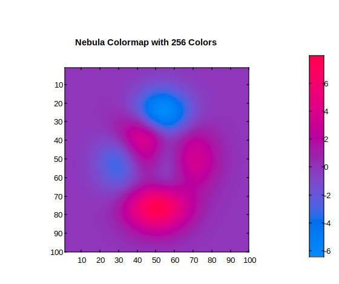

# nebula

Palette de couleurs Nebula.

## 📝 Syntaxe

- c = nebula
- c = nebula(m)

## 📥 Argument d'entrée

- m - Valeur entière scalaire : nombre de couleurs (256 par défaut).

## 📤 Argument de sortie

- c - Palette de couleurs Nebula.

## 📄 Description

<b>nebula</b> retourne la palette de couleurs Nebula.

## 💡 Exemple

```matlab
f = figure();
n = 256;
cmap = nebula(n);
colormap(cmap);
imagesc(peaks(100));
colorbar;
title(['Nebula Colormap with ', num2str(n), ' Colors']);
```



## 🔗 Voir aussi

[colormap](../graphics/colormap/colormap.md).

## 🕔 Historique

| Version | 📄 Description   |
| ------- | ---------------- |
| 1.14.0  | version initiale |

<!--
## 👤 Auteur

Allan CORNET
-->
