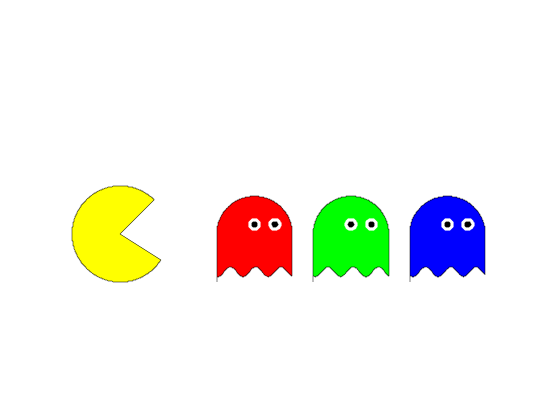
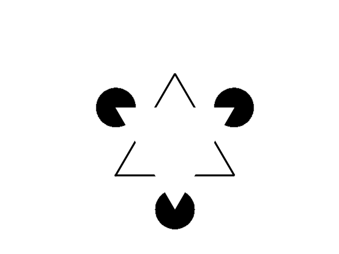
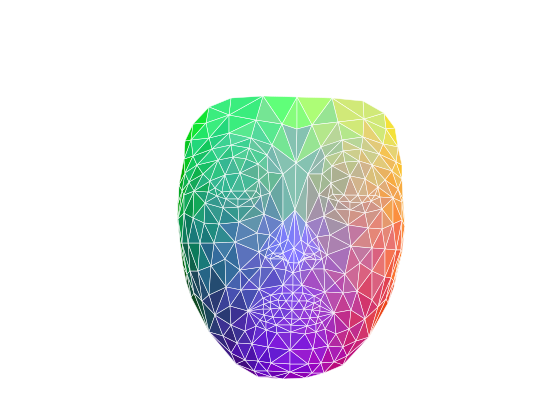
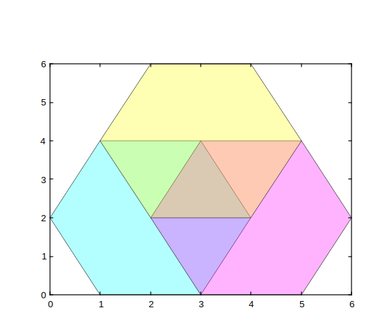

# patch

Créer des patchs de polygones colorés

## 📝 Syntaxe

- patch(X, Y, C)
- patch(X, Y, Z, C)
- patch('XData', X, 'YData', Y)
- patch('XData', X, 'YData', Y, 'ZData', Z)
- patch('Faces', F, 'Vertices', V)
- patch(S)
- patch(..., propertyName, propertyValue)
- patch(ax, ...)
- go = patch(...)

## 📥 Argument d'entrée

- X - Coordonnées x : vecteur ou matrice.
- Y - Coordonnées y : vecteur ou matrice.
- Z - Coordonnées z : vecteur ou matrice.
- C - Tableau de couleurs : scalaire, vecteur, tableau m-par-n-par-3 de triplets RGB.
- ax - Valeur scalaire d'objet graphique : conteneur parent, spécifié comme axes.
- propertyName - Chaîne de caractères scalaire ou vecteur ligne.
- propertyValue - Une valeur.
- S - Structure avec des champs correspondant aux propriétés du patch et leurs valeurs.

## 📤 Argument de sortie

- go - Objet graphique : type patch.

## 📄 Description

<b>patch(X, Y, C)</b> crée une forme polygonale 2D avec des sommets définis par les coordonnées <b>X</b> et <b>Y</b>, et remplit la forme avec la couleur <b>C</b>.

<b>patch(X, Y, Z, C)</b> crée une forme polygonale 3D avec des sommets définis par les coordonnées <b>X</b>, <b>Y</b> et <b>Z</b>, et remplit la forme avec la couleur <b>C</b>.

<b>patch(..., PropertyName, PropertyValue, ...)</b> définit des propriétés optionnelles pour l'objet patch à l'aide de paires nom-valeur.

<b>patch('Faces', F, 'Vertices', V)</b> crée un ou plusieurs polygones.

<b>go = patch(...)</b> retourne le handle <b>go</b> de l'objet patch créé.

Paires Nom-Valeur de propriétés :

<b>
        'FaceColor'
      </b> : couleur de la forme remplie. FaceColor peut être une chaîne de caractères ou un vecteur RGB à 3 éléments. Par défaut :<b>
        'flat'
      </b>.

<b>
        'EdgeColor'
      </b> : couleur des bords du polygone. EdgeColor peut être une chaîne de caractères ou un vecteur RGB à 3 éléments. Par défaut :<b>
        'none'
      </b>.

<b>
        'LineWidth'
      </b> : largeur des bords du polygone. Par défaut :<b>0.5</b>.

<b>
        'LineStyle'
      </b> : style des bords du polygone. LineStyle peut être une chaîne de caractères ou un code de style de ligne. Par défaut :<b>
        '-'
      </b>.

<b>
        'FaceAlpha'
      </b> : transparence de la forme remplie. FaceAlpha peut être un scalaire entre 0 et 1. Par défaut :<b>1</b>.

<b>
        'EdgeAlpha'
      </b> : transparence des bords du polygone. EdgeAlpha peut être un scalaire entre 0 et 1. Par défaut :<b>1</b>.

<b>
        'Parent'
      </b> : handle de l'objet parent du patch. Par défaut : <b>gca()</b>.

<b>
        'Vertices'
      </b> : matrice des coordonnées des sommets. La matrice doit être de taille N-par-2 ou N-par-3, où N est le nombre de sommets. Par défaut : les coordonnées des sommets sont spécifiées par les arguments <b>X</b>, <b>Y</b> et <b>Z</b>.

<b>CreateFcn</b> Callback (fonction, chaîne ou cellule) appelée lors de la création de l'objet. Définir cette propriété sur un composant existant n'a aucun effet.

<b>DeleteFcn</b> Callback (fonction, chaîne ou cellule) appelée lors de la suppression de l'objet.

<b>BeingDeleted</b> Indique que l'objet est en cours de suppression.

## 💡 Exemples

```matlab
fig = figure('Color', 'k');
ax.Color = 'k';
f=0.1;
t=0:f^2:2*pi;
r=pi/4;
p=r*t+r;
patch([cos(p), 0], [sin(p), 0], 'y');
c = eye(3);
for a=2:2:6
  patch([t/4+a, a+r*(1+cos(t/2)),a], [-f*cos(3*(a+t))-r,r*sin(t/2),-1], c(a/2,:));
  patch(a +f*cos(t)'+r./[1,0.65], f*(2+sin(t)').*[1,1], 'k', 'EdgeColor', 'w', 'LineWidth', pi)
end
axis equal
axis off
```



```matlab
f =figure('Color', 'w');
x = [-1 1 0 -1];
y = [-1/sqrt(3) -1/sqrt(3) 2*sqrt(3)/3 -1/sqrt(3)];
plot(x,y,'k','LineWidth',3);
t = 0:0.001:2*pi;
xc = cos(t)/3+x';
yc = sin(t)/3-y';
for i = 1:3
    patch(xc(i,:),yc(i,:),'k');
end
patch(x,-y,'w','EdgeColor','w');
axis('equal')
axis('off')
```


Nerfertiti 3D mask

```matlab
nefertiti_directory = [modulepath('graphics', 'root'), '/examples/nefertiti-mask/'];
load([nefertiti_directory, 'nefertiti-mask.nh5']);
figure('Color', [1, 1, 1]);
patch('Faces', Faces, 'Vertices', Vertices, 'FaceVertexCData', Colors, ...
      'EdgeColor', 'none', ...
      'FaceColor', 'interp', 'FaceAlpha', 1);
axis equal
axis off
view([0, 0, 1]);
```


Alpha channel

```matlab
x = [1 3 4 3 1 0];
y = [0 0 2 4 4 2];
z = [0 0 0 0 0 0];
figure();
hold on
patch(x,y,z,'cyan','FaceAlpha',0.3)
patch(x+2,y,z,'magenta','FaceAlpha',0.3)
patch(x+1,y+2,z,'yellow','FaceAlpha',0.3)
```



## 🔗 Voir aussi

[surf](../graphics/surf.md), [colormap](../graphics/colormap.md).

## 🕔 Historique

| Version | 📄 Description                            |
| ------- | ----------------------------------------- |
| 1.0.0   | version initiale                          |
| 1.7.0   | Ajout des callbacks CreateFcn, DeleteFcn. |
| --      | Ajout de la propriété BeingDeleted.       |

<!--
## 👤 Auteur

Allan CORNET
-->
