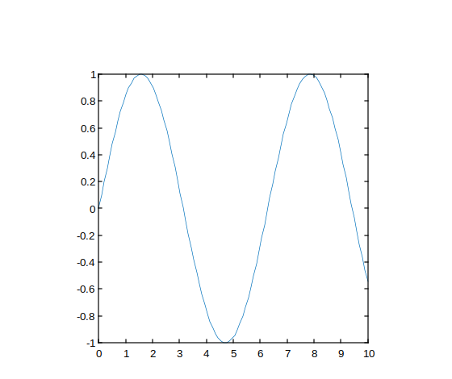
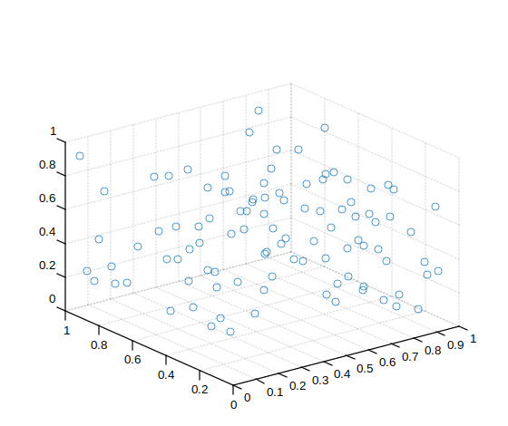
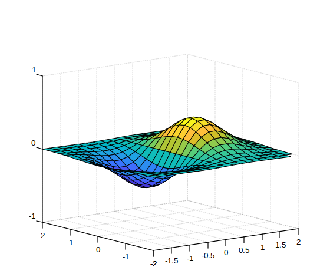

# pbaspect

Contrôler les longueurs relatives de chaque axe dans la boîte de tracé.

## 📝 Syntaxe

- pbaspect(ratio)
- pb = pbaspect()
- pbaspect('auto')
- pbaspect('manual')
- m = pbaspect('mode')
- pbaspect(ax, ...)

## 📥 Argument d'entrée

- ratio -

Vecteur à trois éléments de valeurs positives spécifiant les longueurs relatives des axes x, y et z dans la boîte de tracé.

- 'auto' -

Définir le mode du rapport d'aspect de la boîte de tracé sur automatique.

- 'manual' -

Définir le mode du rapport d'aspect de la boîte de tracé sur manuel.

- 'mode' -

Interroger le mode actuel du rapport d'aspect de la boîte de tracé ('auto' ou 'manual').

- ax -

Objet des axes cibles. Si non spécifié, utilise les axes actuels.

## 📤 Argument de sortie

- pb -

Vecteur à trois éléments représentant le rapport d'aspect actuel de la boîte de tracé.

- m -

Mode actuel du rapport d'aspect de la boîte de tracé : 'auto' ou 'manual'.

## 📄 Description

<b>pbaspect</b> contrôle les longueurs relatives des axes x, y et z dans la boîte de tracé.

<b>pbaspect(ratio)</b> définit le rapport d'aspect de la boîte de tracé pour les axes actuels. <b>ratio</b> est un vecteur à trois éléments de valeurs positives. Par exemple, [3 1 1] signifie que l'axe x est trois fois plus long que les axes y et z.

<b>pb = pbaspect()</b> renvoie le rapport d'aspect actuel de la boîte de tracé sous forme de vecteur à trois éléments.

<b>pbaspect('auto')</b> définit le mode du rapport d'aspect de la boîte de tracé sur automatique, permettant aux axes de choisir le rapport.

<b>pbaspect('manual')</b> définit le mode sur manuel et utilise le rapport stocké dans les axes.

<b>m = pbaspect('mode')</b> renvoie le mode actuel, soit 'auto' soit 'manual'.

<b>pbaspect(ax, ...)</b> agit sur les axes spécifiés par <b>ax</b> au lieu des axes actuels.

Définir le rapport d'aspect de la boîte de tracé désactive le comportement d'étirement pour remplir les axes.

## 💡 Exemples

Utiliser des longueurs d'axes égales

```matlab

x = linspace(0,10,100);
y = sin(x);
plot(x, y)
pbaspect([1 1 1])

```


Utiliser des longueurs d'axes différentes

```matlab

[x, y] = meshgrid(-2:0.2:2);
z = x .* exp(-x.^2 - y.^2);
surf(x, y, z)
pbaspect([2 1 1])
disp(pbaspect('mode'))

```


Revenir au rapport d'aspect par défaut de la boîte de tracé

```matlab

X = rand(100,1);
Y = rand(100,1);
Z = rand(100,1);
scatter3(X, Y, Z)
pbaspect([3 2 1])
pbaspect('auto')

```


Interroger le rapport d'aspect de la boîte de tracé

```matlab

[x, y] = meshgrid(-2:0.2:2);
z = x .* exp(-x.^2 - y.^2);
surf(x, y, z)
pb = pbaspect()
disp(pb)

```


Définir le rapport d'aspect de la boîte de tracé pour un objet axes spécifique

```matlab

f = figure();
ax1 = subplot(2, 1, 1);
plot(ax1, 1:10)
ax2 = subplot(2, 1, 2);
plot(ax2, 1:10)
pbaspect(ax2, [2 2 1])

```


## 🔗 Voir aussi

[daspect](../graphics/daspect.md), [axis](../graphics/axis.md), [xlim](../graphics/xlim.md), [ylim](../graphics/ylim.md), [zlim](../graphics/zlim.md).

## 🕔 Historique

| Version | 📄 Description   |
| ------- | ---------------- |
| 1.16.0  | version initiale |

<!--
## 👤 Auteur

Allan CORNET
-->
