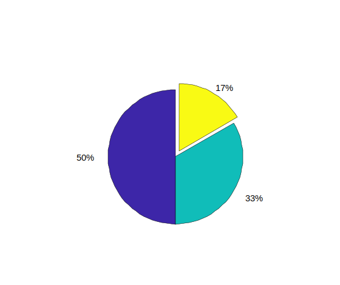
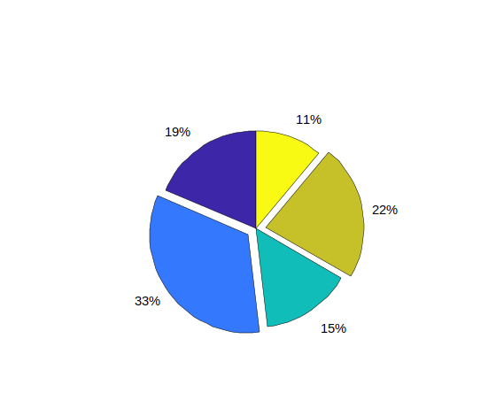
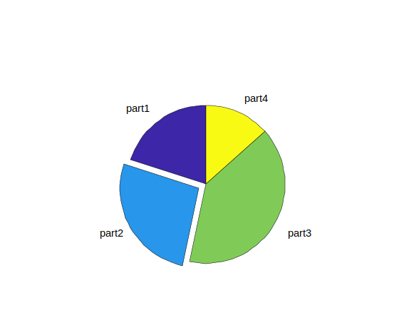
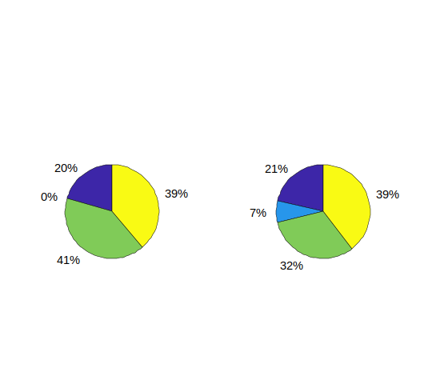

# pie

Ancien graphique en secteurs (camembert).

## 📝 Syntaxe

- pie(X)
- pie(X, explode)
- pie(X, labels)
- pie(X, explode, labels)
- pie(ax, ...)
- p = pie(...)

## 📥 Argument d'entrée

- X - Vecteur ou matrice.
- explode - Décalage des parts : vecteur ou matrice numérique, vecteur ou matrice logique, tableau de chaînes ou cellule de chaînes de caractères.
- labels - '%.0f%%' (par défaut) ou tableau d'étiquettes de texte
- ax - Objet axes.

## 📤 Argument de sortie

- p - Vecteur d'objets patch et text.

## 📄 Description

<b>pie(X)</b> génère un graphique en secteurs (camembert) à partir des données du tableau<b>X</b>.

Si la somme des éléments de <b>X</b> est inférieure ou égale à 1, les valeurs de <b>X</b> représentent directement les aires proportionnelles des parts du camembert.

Si la somme de <b>X</b> est inférieure à 1, le graphique affiche seulement une portion du camembert.

Si la somme de <b>X</b> dépasse 1, la fonction normalise les valeurs en divisant chaque élément par la somme de <b>X</b>.

Cette normalisation garantit que le graphique reflète fidèlement les proportions relatives des données.

Si<b>X</b> est une variable catégorielle, chaque part du camembert correspond à une catégorie, et l'aire de chaque part est déterminée par le rapport du nombre d'éléments de la catégorie sur le nombre total d'éléments de <b>X</b>.

## 💡 Exemples

```matlab
f = figure();
p = pie ([3, 2, 1], [0, 0, 1]);
```



```matlab
f = figure();
p = pie([5 9 4 6 3],[0 1 0 1 0]);

```



```matlab
f = figure();
p = pie([3 4 6 2],[0 1 0 0],["part1", "part2", "part3", "part4"]);

```



```matlab
f = figure();
y2010 = [50 0 100 95];
y2011 = [65 22 97 120];
ax1 = subplot(1, 2, 1);
p1 = pie(ax1, y2010)
title('2010')
ax2 = subplot(1, 2, 2);
p2 = pie(ax2, y2011)
title('2011')

```



## 🔗 Voir aussi

[patch](../graphics/patch.md), [text](../graphics/text.md).

## 🕔 Historique

| Version | 📄 Description   |
| ------- | ---------------- |
| 1.0.0   | version initiale |

<!--
## 👤 Auteur

Allan CORNET
-->
