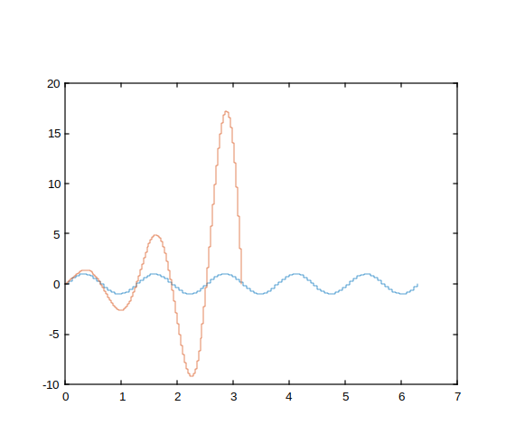
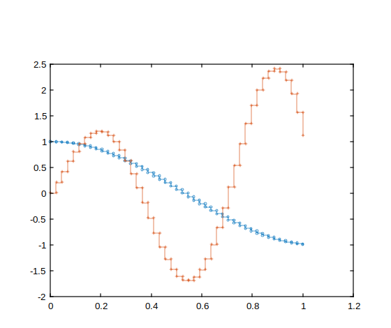

# stairs

Graphique en escalier.

## 📝 Syntaxe

- stairs(Y)
- stairs(X, Y)
- stairs(..., LineSpec)
- stairs(..., Name, Value)
- stairs(ax, ...)
- h = stairs(...)
- [xb, yb] = stairs(...)

## 📥 Argument d'entrée

- X - Valeurs x.
- Y - Valeurs y.
- LineSpec - Style de ligne, marqueur et/ou couleur : vecteur de caractères ou chaîne scalaire.
- propertyName - Une chaîne scalaire ou un vecteur ligne de caractères.
- propertyValue - Une valeur.
- ax - Objet axes.

## 📤 Argument de sortie

- h - Objet ligne.
- xb - Valeurs x à utiliser avec plot
- yb - Valeurs y à utiliser avec plot

## 📄 Description

Les graphiques en escalier sont un outil précieux pour créer des graphiques temporels de données échantillonnées numériquement.

La fonction<b>stairs(Y)</b> permet de générer de tels graphiques en traçant les éléments du vecteur<b>Y</b>.

Si<b>Y</b> est une matrice, une ligne est tracée pour chaque colonne, la couleur des lignes étant déterminée par la propriété ColorOrder des axes.

Dans le cas d'un vecteur <b>Y</b>, l'axe x s'étend de 1 à la longueur de <b>Y</b>, tandis que pour une matrice <b>Y</b>, l'axe x va de 1 au nombre de lignes de <b>Y</b>.

<b>stairs(X, Y)</b> permet de tracer les éléments de <b>Y</b> aux emplacements spécifiques définis par le vecteur <b>X</b>.

Il est important de noter que les éléments de <b>X</b> doivent être dans un ordre monotone pour créer un graphique en escalier valide.

## 💡 Exemples

```matlab
f = figure();
f = figure();
x1 = linspace(0,2*pi)';
x2 = linspace(0,pi)';
X = [x1,x2];
Y = [sin(5*x1),exp(x2).*sin(5*x2)];
ax = gca();
stairs(ax, X,Y)

```



```matlab
X = linspace(0,1,45)';
Y = [cos(3*X), exp(X).*sin(9*X)];
h = stairs(X,Y);
h(1).Marker = 'o';
h(1).MarkerSize = 5;
h(2).Marker = '+';
h(2).MarkerFaceColor = 'm';

```



## 🔗 Voir aussi

[plot](../graphics/plot.md).

## 🕔 Historique

| Version | 📄 Description   |
| ------- | ---------------- |
| 1.0.0   | version initiale |

<!--
## 👤 Auteur

Allan CORNET
-->
