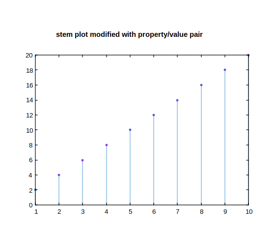
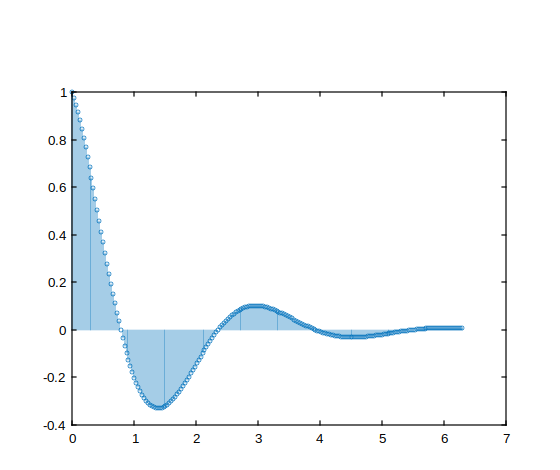

# stem

Tracer des données discrètes.

## 📝 Syntaxe

- stem(Y)
- stem(X, Y)
- stem(..., 'filled')
- stem(..., LineSpec)
- stem(..., propertyName, propertyValue)
- stem(ax, ...)
- go = stem(...)

## 📥 Argument d'entrée

- X - Emplacements pour tracer les valeurs de Y.
- Y - Séquence de données à afficher.
- LineSpec - Style de ligne, marqueur et/ou couleur : vecteur de caractères ou chaîne scalaire.
- propertyName - Une chaîne scalaire ou un vecteur ligne de caractères.
- propertyValue - Une valeur.
- ax - Objet axes.

## 📤 Argument de sortie

- gr - Groupe d'objets graphiques.

## 📄 Description

Un graphique <b>stem</b> en deux dimensions permet de visualiser des données en les représentant par des lignes partant d'une ligne de base horizontale le long de l'axe x.

À l'extrémité de chaque ligne se trouve un cercle (marqueur par défaut), et la position verticale de ce cercle correspond à la valeur de la donnée représentée.

<b>stem(Y)</b> crée un graphique stem en prenant la séquence de données<b>Y</b> et en traçant des tiges partant de points régulièrement espacés et automatiquement déterminés le long de l'axe x.

Si <b>Y</b> est une matrice, la fonction stem trace tous les éléments d'une ligne pour la même valeur de x.

<b>stem(X, Y)</b> crée un graphique stem qui montre comment<b>X</b> est relié aux colonnes de <b>Y</b>.

<b>X</b> et<b>Y</b> peuvent être des vecteurs ou des matrices de même taille.

<b>X</b> peut être un vecteur ligne ou colonne, et<b>Y</b> doit être une matrice ayant le même nombre de lignes que la longueur de <b>X</b>.

Si vous souhaitez spécifier si le cercle à l'extrémité de chaque tige doit être rempli, vous pouvez utiliser <b>stem(...,'fill')</b>.

De plus, en utilisant <b>stem(..., LineSpec)</b>, vous pouvez définir le style de ligne, le symbole du marqueur et la couleur des tiges et du marqueur supérieur.

Consultez <b>LineSpec</b> pour plus de détails sur la personnalisation de l'apparence du graphique stem.

## 💡 Exemples

```matlab
f = figure();
x = 1:10;
y = 2*x;
h = stem (x, y, 'MarkerFaceColor', [1 0 1]);
title('stem plot modified with property/value pair');
```



```matlab
f =figure();
% Defining base line - X input vector ranging from 0 to 2*pi
X = 0 : pi/100 : 2*pi;
% Defining the Y input vector as function of X
Y = exp(-3*X/4) .* cos(2*X);
% Third, we use the 'stem' function to plot discrete values
stem(X,Y)
```



## 🔗 Voir aussi

[plot](../graphics/plot.md).

## 🕔 Historique

| Version | 📄 Description   |
| ------- | ---------------- |
| 1.0.0   | version initiale |

<!--
## 👤 Auteur

Allan CORNET
-->
