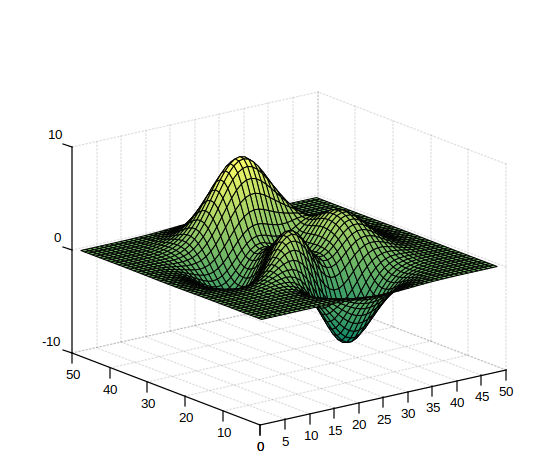

# summer

Table de couleurs 'summer'.

## 📝 Syntaxe

- c = summer
- c = autumn(m)

## 📥 Argument d'entrée

- m - Un entier scalaire : nombre de couleurs (256 par défaut).

## 📤 Argument de sortie

- c - Table de couleurs 'summer'.

## 📄 Description

<b>summer</b> retourne la table de couleurs avec des couleurs d'été.

## 💡 Exemple

```matlab
f = figure();
surf(peaks);
colormap('summer');
```



## 🔗 Voir aussi

[colormap](../graphics/colormap/colormap.md).

## 🕔 Historique

| Version | 📄 Description   |
| ------- | ---------------- |
| 1.0.0   | version initiale |

<!--
## 👤 Auteur

Allan CORNET
-->
