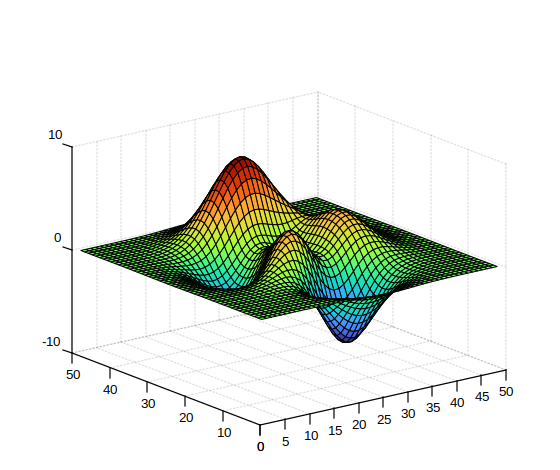

# turbo

Tableau de couleurs Turbo.

## 📝 Syntaxe

- c = turbo
- c = turbo(m)

## 📥 Argument d'entrée

- m - Une valeur entière scalaire : Nombre de couleurs (256 par défaut).

## 📤 Argument de sortie

- c - Tableau de couleurs Turbo.

## 📄 Description

<b>turbo</b> retourne la carte de couleurs avec les couleurs Turbo.

## 💡 Exemple

```matlab
f = figure();
surf(peaks);
colormap('turbo');
```



## 🔗 Voir aussi

[colormap](../graphics/colormap/colormap.md).

## 🕔 Historique

| Version | 📄 Description   |
| ------- | ---------------- |
| 1.0.0   | Version initiale |

<!--
## 👤 Auteur

Allan CORNET
-->
