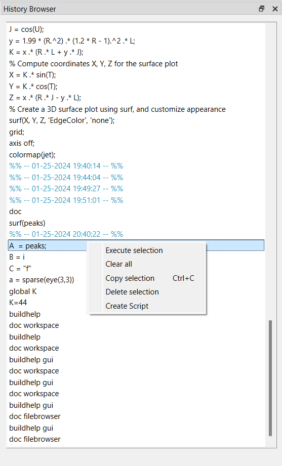

# commandhistory

Historique des commandes

## 📝 Syntaxe

- commandhistory

## 📄 Description

La fenêtre Historique des commandes présente l'historique des commandes exécutées lors de la session actuelle et des sessions précédentes de Nelson. 

Chaque session est horodatée avec le format de date court du système d'exploitation, suivie des commandes correspondantes. 

Les entrées de la fenêtre Historique des commandes peuvent être sélectionnées pour diverses actions et opérations. 

## 🔗 Voir aussi

[workspace](../gui/workspace.md), [filebrowser](../gui/filebrowser.md).

## 🕔 Historique

| Version | 📄 Description     |
| ------- | --------------- |
| 1.1.0   | version initiale |

<!--
## 👤 Auteur

Allan CORNET
-->
