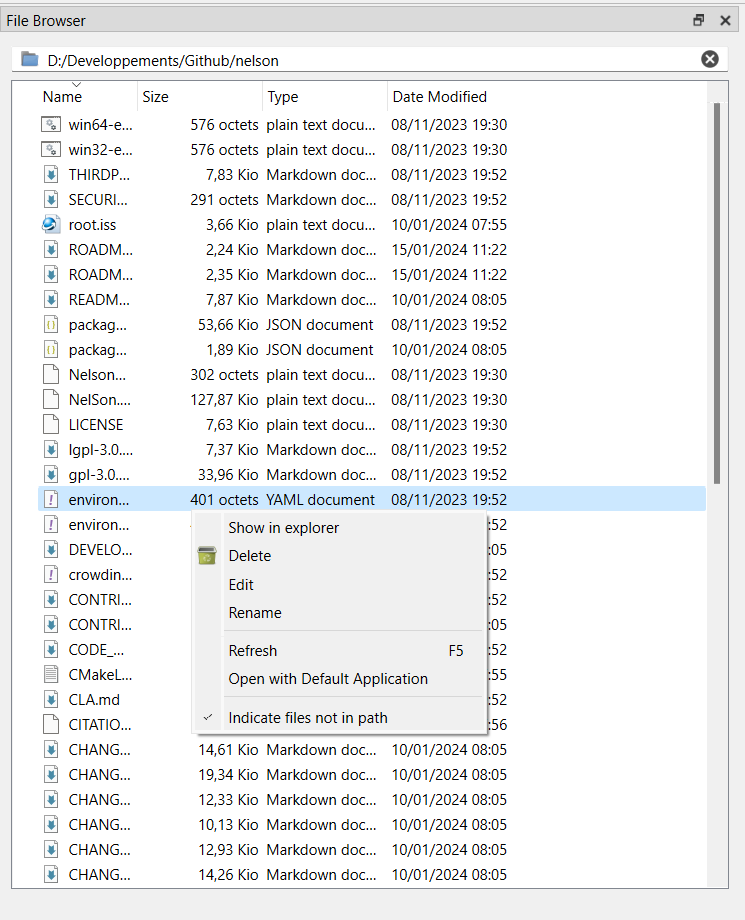

# filebrowser

Explorateur du dossier courant

## 📝 Syntaxe

- filebrowser

## 📄 Description

L'explorateur du dossier courant dans Nelson facilite la gestion interactive des fichiers et dossiers. Utilisez-le pour naviguer, créer, accéder, déplacer et renommer les fichiers et dossiers du répertoire courant.

## 🔗 Voir aussi

[commandhistory](../gui/commandhistory.md), [workspace](../gui/workspace.md).

## 🕔 Historique

| Version | 📄 Description   |
| ------- | ---------------- |
| 1.1.0   | version initiale |

<!--
## 👤 Auteur

Allan CORNET
-->
