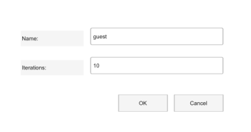

# inputdlg

Ouvre une boite de dialogue de saisie.

## 📝 Syntaxe

- answer = inputdlg(prompt)
- answer = inputdlg(prompt, title)
- answer = inputdlg(prompt, title, dims)
- answer = inputdlg(prompt, title, dims, defaultAnswer)
- answer = inputdlg(prompt, title, dims, defaultAnswer, options)

## 📥 Argument d'entrée

- prompt - Prompt text. Use a character vector, string, or cell array of character vectors for several prompts.

## 📤 Argument de sortie

- answer - Cell array of character vectors. Returns an empty 0-by-0 cell array when the dialog is canceled.

## 📄 Description

inputdlg displays one input prompt after another and returns the entered text.

## 💡 Exemples

Apercu d une boite de saisie.

```matlab
f = dialog('Name', 'Input', 'WindowStyle', 'normal', 'Position', [100 100 360 190]);
uicontrol(f, 'Style', 'text', 'String', 'Name:', 'Position', [30 124 90 22]);
uicontrol(f, 'Style', 'edit', 'String', 'guest', 'Position', [130 126 190 24]);
uicontrol(f, 'Style', 'text', 'String', 'Iterations:', 'Position', [30 82 90 22]);
uicontrol(f, 'Style', 'edit', 'String', '10', 'Position', [130 84 190 24]);
uicontrol(f, 'Style', 'pushbutton', 'String', 'OK', 'Position', [170 30 70 24]);
uicontrol(f, 'Style', 'pushbutton', 'String', 'Cancel', 'Position', [250 30 70 24]);
```


Ask for several values with defaults.

```matlab
prompt = {'First name:', 'Last name:'};
defaults = {'Ada', 'Lovelace'};
answer = inputdlg(prompt, 'User', [1 35], defaults);
if ~isempty(answer), disp(answer{1}); end
```

## 🔗 Voir aussi

[listdlg](../gui/listdlg.md), [questdlg](../gui/questdlg.md).

## 🕔 Historique

| Version | 📄 Description                         |
| ------- | -------------------------------------- |
| 2.0.0   | version aide API dialogue mise a jour. |

<!--
## 👤 Auteur

Allan CORNET
-->
