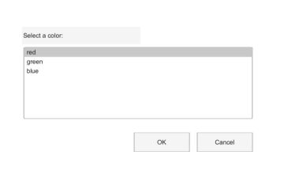

# listdlg

Ouvre une boite de dialogue de selection dans une liste.

## 📝 Syntaxe

- [selection, ok] = listdlg(Name, Value)

## 📥 Argument d'entrée

- 'ListString' - Required list entries. Use a cell array of character vectors or a string array.

## 📤 Argument de sortie

- selection - Row vector of selected one-based indices. Empty when canceled.

## 📄 Description

listdlg displays selectable text entries and returns the selected indices.

## 💡 Exemples

Apercu d une boite de selection dans une liste.

```matlab
f = dialog('Name', 'List Selection', 'WindowStyle', 'normal', 'Position', [100 100 360 220]);
uicontrol(f, 'Style', 'text', 'String', 'Select a color:', 'Position', [28 164 150 22]);
uicontrol(f, 'Style', 'listbox', 'String', {'red', 'green', 'blue'}, 'Value', 2, 'Position', [30 70 290 90]);
uicontrol(f, 'Style', 'pushbutton', 'String', 'OK', 'Position', [170 28 70 24]);
uicontrol(f, 'Style', 'pushbutton', 'String', 'Cancel', 'Position', [250 28 70 24]);
```


Select several entries from a list.

```matlab
items = {'low', 'medium', 'high'};
[selection, ok] = listdlg('ListString', items, 'SelectionMode', 'multiple', 'InitialValue', [1 3]);
if ok, disp(selection); end
```

## 🔗 Voir aussi

[inputdlg](../gui/inputdlg.md), [questdlg](../gui/questdlg.md).

## 🕔 Historique

| Version | 📄 Description                         |
| ------- | -------------------------------------- |
| 2.0.0   | version aide API dialogue mise a jour. |

<!--
## 👤 Auteur

Allan CORNET
-->
